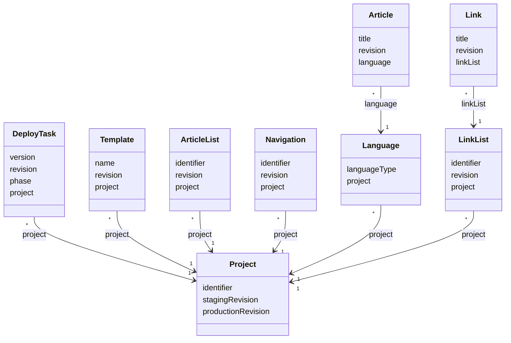

# TN0102 Revision

A **Revision** is the per-project change counter used to decide what a deployment must
re-render. Content models ([Template](TN0401_template.md), [Article](TN0501_article.md),
[Article List](TN0502_article_list.md), [Link](TN0503_link.md),
[Link List](TN0504_link_list.md), [Navigation](TN0601_navigation.md)) each carry a
`revision: Long` stamp; the [Project](TN0301_project.md) carries two high-water marks —
`stagingRevision` and `productionRevision`, one per `DeployPhase` — recording the revision last
deployed to each phase. During a deployment, a model whose `revision` is **greater than** the
project's phase revision is re-rendered; a model at or below it is skipped. It is a single
shared counter per project, not a per-model version history.

## Code mapping

| Declaration | Where | Source |
|---|---|---|
| `revision: Long` column | `Template`, `Article`, `ArticleList`, `Link`, `LinkList`, `Navigation` | [Template.kt](/source/pager-backend/domain/src/main/kotlin/com/xwkj/pager/domain/model/database/Template.kt), [Article.kt](/source/pager-backend/domain/src/main/kotlin/com/xwkj/pager/domain/model/database/Article.kt), [ArticleList.kt](/source/pager-backend/domain/src/main/kotlin/com/xwkj/pager/domain/model/database/ArticleList.kt), [Link.kt](/source/pager-backend/domain/src/main/kotlin/com/xwkj/pager/domain/model/database/Link.kt), [LinkList.kt](/source/pager-backend/domain/src/main/kotlin/com/xwkj/pager/domain/model/database/LinkList.kt), [Navigation.kt](/source/pager-backend/domain/src/main/kotlin/com/xwkj/pager/domain/model/database/Navigation.kt) |
| `stagingRevision`, `productionRevision` columns; computed `maxRevision` = `max(stagingRevision, productionRevision)` | `Project` | [Project.kt](/source/pager-backend/domain/src/main/kotlin/com/xwkj/pager/domain/model/database/Project.kt) |
| `revision` column; computed `projectCurrentRevision` (selects `project.stagingRevision` or `project.productionRevision` by `phase`) | `DeployTask` | [DeployTask.kt](/source/pager-backend/domain/src/main/kotlin/com/xwkj/pager/domain/model/database/DeployTask.kt) |
| Comparison and propagation logic | `DeployService` (submit), `ProjectDeployService` and its extensions (scan / finish) | [DeployService.kt](/source/pager-backend/domain/src/main/kotlin/com/xwkj/pager/domain/service/DeployService.kt), [ProjectDeployService.kt](/source/pager-backend/app/consumer/src/main/kotlin/com/xwkj/pager/consumer/service/ProjectDeployService.kt) |

## Usage across models

### Where the counter lives

| Field | Model | Meaning |
|---|---|---|
| `revision` | `Template`, `Article`, `ArticleList`, `Link`, `LinkList`, `Navigation` | The project-wide counter value at which this record was last created or edited. |
| `stagingRevision` | `Project` | Revision last deployed to the `STAGING` phase; initialized to `0` at project creation. |
| `productionRevision` | `Project` | Revision last deployed to the `PRODUCTION` phase; initialized to `0` at project creation. |
| `maxRevision` (computed) | `Project` | `max(stagingRevision, productionRevision)` — the base for stamping new content. |
| `revision` | `DeployTask` | Set to `(latestDeploy?.revision ?: 0) + 1` at submission, then **overwritten** at completion with the highest revision actually rendered. |
| `projectCurrentRevision` (computed) | `DeployTask` | `project.stagingRevision` when `phase` is `DeployPhase.STAGING`, `project.productionRevision` when `DeployPhase.PRODUCTION` — the threshold the scan compares against. |
| `version` | `DeployTask` | A separate per-phase run counter (`(latestDeploy?.version ?: 0) + 1`); not a revision, listed here only to distinguish the two fields. |

### Lifecycle of the counter

1. **Stamping.** New content is stamped `revision = project.maxRevision + 1` (seen in
   `TemplateService`, `ArticleService`, `ArticleListService`, `NavigationArticleService`,
   `NavigationListService`, and the consumer's `ProjectZipAnalyzer`). Edits stamp
   `revision = <entity>.revision + 1` (e.g. `TemplateService`, `ArticleService`,
   `ArticleListService`). Either way the stamp exceeds both phase revisions, marking the record
   as newer than every deployed site.
2. **Scanning.** When the consumer processes a [Deploy Task](TN0701_deploy_task.md), it takes
   `currentRevision = deployTask.projectCurrentRevision` and walks the template tree, the
   navigation tree, and the article lists. A page is re-rendered only when its effective
   revision exceeds `currentRevision`; subtrees whose accumulated `maxRevision <= currentRevision`
   are skipped. A page's effective revision is the **max** over everything rendered into it —
   the template itself, `{pager:include}`d templates, the article list's rendering template and
   the member articles (e.g. `max(articleListItems.maxOf { it.article.revision },
   articleList.revision)`) — carried through `DeployStep.maxRevision` / `HtmlWithRevision`. If
   no step survives the comparison, the task ends in `DeployState.NOTHING_TO_DEPLOY`.
3. **Advancing the high-water mark.** `ProjectDeployService.finishDeploy` sets the task's
   `revision = deploySteps.maxOf { it.maxRevision }`, copies that value onto **every**
   `Template`, `ArticleList`, `Article`, and `Navigation` of the project, and writes it into the
   phase field selected by `deployTask.phase` (`stagingRevision` or `productionRevision`).
4. **Reset.** `DeployService.forceDeploy` empties the phase's [Bucket](TN0702_bucket.md) and
   resets that phase's revision to `0`, so the next scan treats all content as newer and
   re-renders the whole site.

### Notes recorded verbatim from the implementation

- `finishDeploy` propagates the finished revision to `Template`, `ArticleList`, `Article`, and
  `Navigation` only — the `revision` fields on `Link` and `LinkList` are **not** reset there. In
  the current code `Link` / `LinkList` are referenced only by `PrecompiledLinkList`; no DAO or
  service reads or writes their `revision`.
- `DeployTask.revision` holds two different values over its life: the submit-time guess
  `(latestDeploy?.revision ?: 0) + 1` and, after `finishDeploy`, the max rendered revision.

## Relationships

- **[Project](TN0301_project.md)** — owns the two phase high-water marks (`stagingRevision`,
  `productionRevision`); one (`1`) project is the comparison base for the many (`*`) revisioned
  records referencing it.
- **[Deploy Task](TN0701_deploy_task.md)** — many (`*`) tasks reference one (`1`) project via
  `project`; each task's `phase` picks which project revision `projectCurrentRevision` returns,
  and its final `revision` becomes the project's new phase revision.
- **[Template](TN0401_template.md)**, **[Article List](TN0502_article_list.md)**,
  **[Navigation](TN0601_navigation.md)** — many (`*`) records carry a `revision` and reference
  one (`1`) project via `project`; all are re-stamped by `finishDeploy`.
- **[Article](TN0501_article.md)** — carries a `revision`; reaches the project indirectly, many
  (`*`) articles referencing one (`1`) [Language](TN0302_language.md) via `language`, and many
  (`*`) languages referencing one (`1`) project.
- **[Link](TN0503_link.md)**, **[Link List](TN0504_link_list.md)** — carry `revision` fields
  (many (`*`) links per link list via `linkList`, many (`*`) link lists per project) but are not
  part of the `finishDeploy` propagation in the current code.

## Diagram

Only the revision-carrying fields and the references that connect each carrier to the project's
phase counters are shown.

