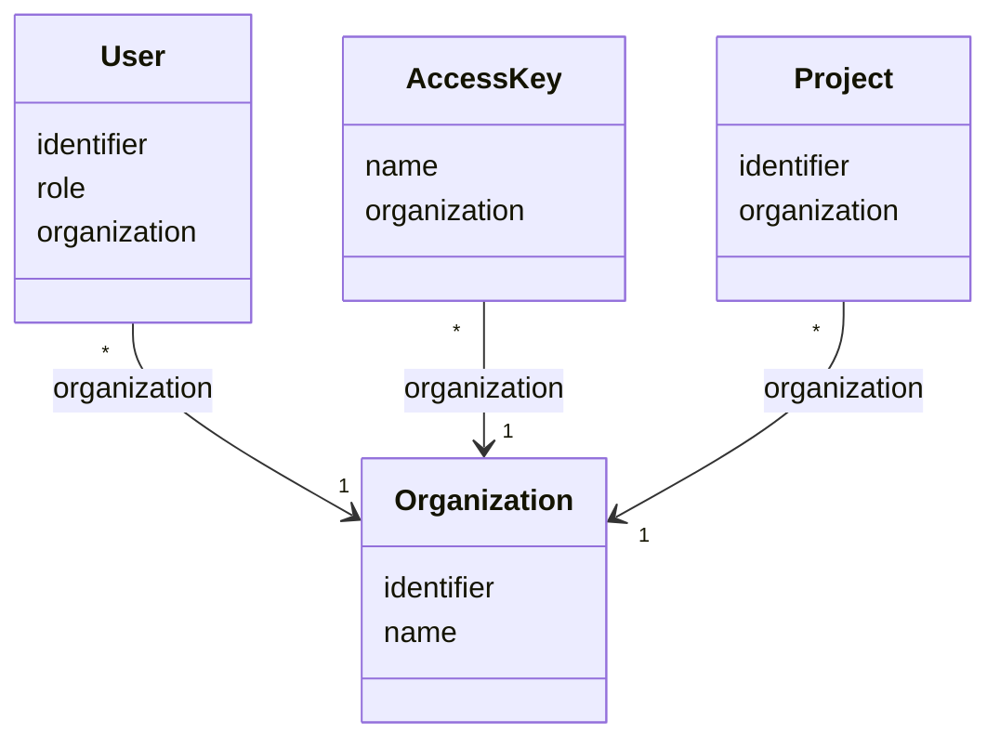

# TN0201 Organization

The tenant unit of the Pager CMS. An organization owns the [users](TN0202_user.md) and
[access keys](TN0204_access_key.md) registered under it, and every [Project](TN0301_project.md)
belongs to exactly one organization. All authenticated CMS requests are scoped to one
organization through the `organizationId` carried in the authenticated principal `JwtUser`
(see [User](TN0202_user.md)).

## Code mapping

| Entity class | DB table | Source |
|---|---|---|
| `Organization` | `pager_organization` | [Organization.kt](/source/pager-backend/domain/src/main/kotlin/com/xwkj/pager/domain/model/database/Organization.kt) |

## Important fields

| Field | Type | Description |
|---|---|---|
| `id` | `Long?` | Primary key, auto-generated (`GenerationType.IDENTITY`). |
| `createAt` | `Long` | Creation timestamp, stored as a numeric epoch value. |
| `updateAt` | `Long` | Last-update timestamp, stored as a numeric epoch value. |
| `identifier` | `String` | The stable machine-readable key of the organization, distinct from the display `name` (see [Identifier](TN0101_identifier.md)). |
| `name` | `String` | Human-readable display name of the organization. |

No enum-typed fields are defined on this entity.

## Relationships

- Referenced by [User](TN0202_user.md) via `User.organization` (`@ManyToOne`, join column `organization_id`, non-null) — one organization has many users; each user belongs to exactly one organization.
- Referenced by [Access Key](TN0204_access_key.md) via `AccessKey.organization` (`@ManyToOne`, join column `organization_id`, non-null) — one organization registers many access keys; each access key belongs to exactly one organization.
- Referenced by [Project](TN0301_project.md) via `Project.organization` (`@ManyToOne`, join column `organization_id`, non-null) — one organization owns many projects; each project belongs to exactly one organization.

## Diagram

