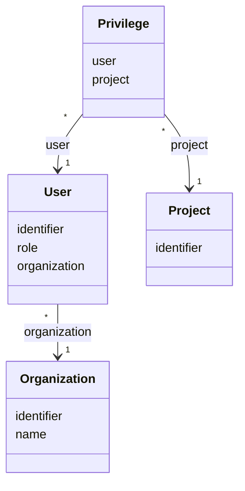

# TN0202 User

A CMS login account belonging to one [Organization](TN0201_organization.md). Sign-in is
performed with the user's `identifier` and a password (`UserService.login`); on success a JWT is
issued. The `role` field (hierarchy `OWNER` > `ADMIN` > `DEVELOPER` > `CUSTOMER`) determines the
fixed permission set granted to the account. For the non-admin roles (`DEVELOPER`, `CUSTOMER`),
access to individual projects is additionally granted per project through
[Privilege](TN0203_privilege.md) rows.

## Code mapping

| Entity class | DB table | Source |
|---|---|---|
| `User` | `pager_user` | [User.kt](/source/pager-backend/domain/src/main/kotlin/com/xwkj/pager/domain/model/database/User.kt) |
| `UserRole` (enum) | stored as a string in `pager_user.role` | [UserRole.kt](/source/pager-backend/domain/src/main/kotlin/com/xwkj/pager/domain/model/enum/UserRole.kt) |

## Important fields

| Field | Type | Description |
|---|---|---|
| `id` | `Long?` | Primary key, auto-generated (`GenerationType.IDENTITY`). |
| `createAt` | `Long` | Creation timestamp, stored as a numeric epoch value. |
| `updateAt` | `Long` | Last-update timestamp, stored as a numeric epoch value. |
| `identifier` | `String` | The login ID entered at sign-in; looked up by `UserDao.getByIdentifier` in `UserService.login` (see [Identifier](TN0101_identifier.md)). |
| `credential` | `String` | The password hash: written with Spring Security `PasswordEncoder.encode` on creation and verified with `PasswordEncoder.matches` at login. |
| `mail` | `String` | E-mail address of the account. |
| `name` | `String` | Human-readable display name. |
| `role` | `UserRole` | The account's role, mapped with `@Enumerated(EnumType.STRING)`; see the value table below. |
| `enabled` | `Boolean` | Account-enabled flag. |
| `organization` | `Organization` | `@ManyToOne`, join column `organization_id`, non-null; the owning [Organization](TN0201_organization.md). |

### `role` — enum `UserRole`

The role hierarchy is `OWNER` > `ADMIN` > `DEVELOPER` > `CUSTOMER`. Each value maps to a fixed
permission set through the computed property `UserRole.permissions`. The permission names below
are copied verbatim from the code; the definition of each individual permission is **not**
repeated here — see [/doc/permission/](../permission/README.md).

| Value | `roleName` (display name) | Permission set (`UserRole.permissions`) |
|---|---|---|
| `OWNER` | `所有者` | `ADMIN_WRITE`, `USER_READ`, `USER_WRITE`, `ACCESS_KEY_READ`, `ACCESS_KEY_WRITE`, `PROJECT_READ`, `PROJECT_WRITE`, `PROJECT_DEV`, `PROJECT_DEPLOY`, `ARTICLE_LIST_READ`, `ARTICLE_LIST_WRITE`, `ARTICLE_READ`, `ARTICLE_WRITE` |
| `ADMIN` | `管理员` | `USER_READ`, `USER_WRITE`, `ACCESS_KEY_READ`, `ACCESS_KEY_WRITE`, `PROJECT_READ`, `PROJECT_WRITE`, `PROJECT_DEV`, `PROJECT_DEPLOY`, `ARTICLE_LIST_READ`, `ARTICLE_LIST_WRITE`, `ARTICLE_READ`, `ARTICLE_WRITE` |
| `DEVELOPER` | `开发者` | `PROJECT_READ`, `PROJECT_DEV`, `PROJECT_DEPLOY`, `ARTICLE_LIST_READ`, `ARTICLE_LIST_WRITE`, `ARTICLE_READ`, `ARTICLE_WRITE` |
| `CUSTOMER` | `客户` | `PROJECT_READ`, `PROJECT_DEPLOY`, `ARTICLE_LIST_READ`, `ARTICLE_LIST_WRITE`, `ARTICLE_READ`, `ARTICLE_WRITE` |

Factual notes (verbatim observations, not corrections):

- `ADMIN` holds the full `OWNER` set except `ADMIN_WRITE`.
- The `UserPermission` enum also declares `LABEL_READ` and `LABEL_WRITE`, but no `UserRole`
  value grants them — `UserRole.permissions` never includes either
  ([UserPermission.kt](/source/pager-backend/domain/src/main/kotlin/com/xwkj/pager/domain/model/enum/UserPermission.kt)).
- `roleName` is the enum's Chinese display-name property; the values above are quoted verbatim
  from the code.

### Authenticated principal — `JwtUser`

After JWT validation, the request principal is carried as the data class `JwtUser`
(`userId`, `organizationId`, `role`), defined in
[JwtUser.kt](/source/pager-backend/domain/src/main/kotlin/com/xwkj/pager/domain/model/security/JwtUser.kt).
The effective permission set is derived from its `role` via `UserRole.permissions`; per-project
access for non-admin roles is then checked through [Privilege](TN0203_privilege.md).

## Relationships

- Belongs to one [Organization](TN0201_organization.md) via `User.organization` (join column `organization_id`) — many users per organization, exactly one organization per user.
- Referenced by [Privilege](TN0203_privilege.md) via `Privilege.user` (join column `user_id`) — one user may hold many project grants; each grant names exactly one user.

## Diagram

