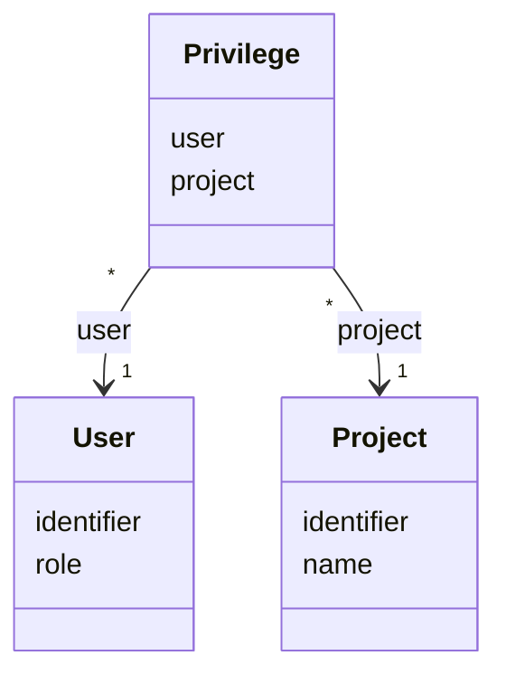

# TN0203 Privilege

The grant that gives a [User](TN0202_user.md) access to a specific
[Project](TN0301_project.md). One row links one user to one project. Enforcement is centralized
in `PrivilegeComponent.check`
([PrivilegeComponent.kt](/source/pager-backend/domain/src/main/kotlin/com/xwkj/pager/domain/component/PrivilegeComponent.kt)):
callers with role `OWNER` or `ADMIN` skip the check entirely; for the other roles
(`DEVELOPER`, `CUSTOMER`) the target project must appear among the caller's privileges
(`PrivilegeDao.findByUser`), otherwise the error `ProjectNoPrivilege` (code `40002`) is raised
(see [/doc/backend_error/](../backend_error/README.md)).

## Code mapping

| Entity class | DB table | Source |
|---|---|---|
| `Privilege` | `pager_privilege` | [Privilege.kt](/source/pager-backend/domain/src/main/kotlin/com/xwkj/pager/domain/model/database/Privilege.kt) |

## Important fields

| Field | Type | Description |
|---|---|---|
| `id` | `Long?` | Primary key, auto-generated (`GenerationType.IDENTITY`). |
| `createAt` | `Long` | Creation timestamp, stored as a numeric epoch value. |
| `updateAt` | `Long` | Last-update timestamp, stored as a numeric epoch value. |
| `user` | `User` | `@ManyToOne`, join column `user_id`, non-null; the grantee. |
| `project` | `Project` | `@ManyToOne`, join column `project_id`, non-null; the project being granted. |

No enum-typed fields are defined on this entity.

Factual note: no unique constraint on the (`user_id`, `project_id`) pair is declared in the
entity mapping, so duplicate grant rows are not prevented at the schema level.

## Relationships

- References [User](TN0202_user.md) via `Privilege.user` (join column `user_id`) — each privilege names exactly one user; one user may hold many privileges.
- References [Project](TN0301_project.md) via `Privilege.project` (join column `project_id`) — each privilege names exactly one project; one project may be granted to many users.

## Diagram

