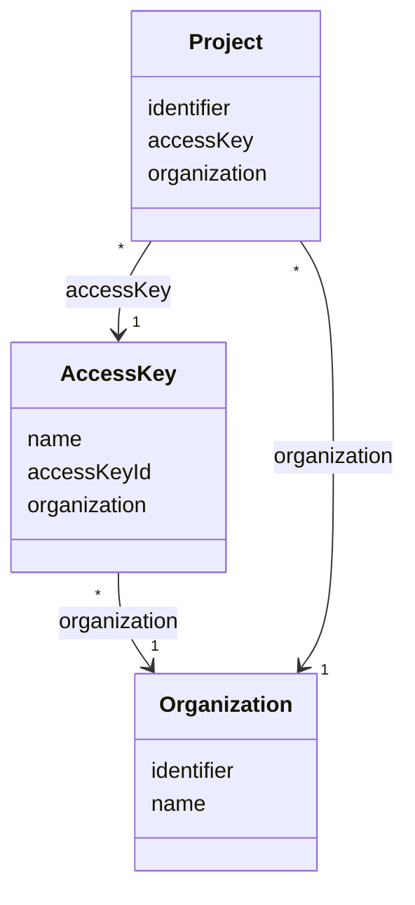

# TN0204 Access Key

An Aliyun access-key pair (`accessKeyId` / `accessKeySecret`) registered per
[Organization](TN0201_organization.md) and used as the OSS credential for creating and deploying
a project's site buckets. Each [Project](TN0301_project.md) references exactly one access key
through its `accessKey` field; at project-creation and deploy time the stored pair is decrypted
and wrapped into an `OssCredential` (`ProjectService`, `DeployService`).

## Code mapping

| Entity class | DB table | Source |
|---|---|---|
| `AccessKey` | `pager_access_key` | [AccessKey.kt](/source/pager-backend/domain/src/main/kotlin/com/xwkj/pager/domain/model/database/AccessKey.kt) |

## Important fields

| Field | Type | Description |
|---|---|---|
| `id` | `Long?` | Primary key, auto-generated (`GenerationType.IDENTITY`). |
| `createAt` | `Long` | Creation timestamp, stored as a numeric epoch value. |
| `updateAt` | `Long` | Last-update timestamp, stored as a numeric epoch value. |
| `name` | `String` | Human-readable display name of the key pair. |
| `accessKeyId` | `String` | The Aliyun AccessKey ID. Stored encrypted: `CryptoComponent.encrypt` on write (`AccessKeyService`), `CryptoComponent.decrypt` on read. |
| `accessKeySecret` | `String` | The Aliyun AccessKey secret. Stored encrypted in the same way as `accessKeyId`. |
| `organization` | `Organization` | `@ManyToOne`, join column `organization_id`, non-null; the owning [Organization](TN0201_organization.md). |

No enum-typed fields are defined on this entity.

Factual note: the name `accessKeyId` is used for two different values in the backend — the
entity field `accessKeyId` holds the Aliyun key-ID string, while API paths such as
`PUT /v1/access_key/{accessKeyId}` (`AccessKeyController`) bind `accessKeyId` to the entity's
numeric `id`. Both usages are copied verbatim.

## Relationships

- Belongs to one [Organization](TN0201_organization.md) via `AccessKey.organization` (join column `organization_id`) — many access keys per organization, exactly one organization per access key.
- Referenced by [Project](TN0301_project.md) via `Project.accessKey` (`@ManyToOne`, join column `access_key_id`, non-null) — one access key may be used by many projects; every project references exactly one access key.

## Diagram

