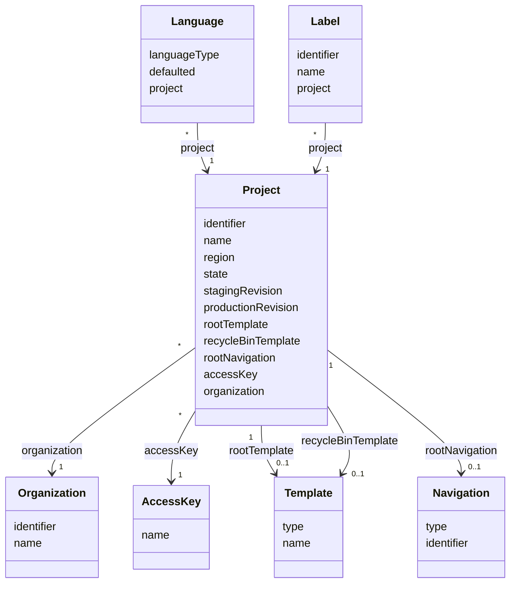

# TN0301 Project

A **Project** is one website being built in Pager. It carries the machine-readable
[Identifier](TN0101_identifier.md) used for bucket/host naming, the Aliyun OSS region the site
is deployed to, a lifecycle state that advances from creation through template upload to
deployment, the index / error document names served by the site, and the staging / production
[Revision](TN0102_revision.md) counters that decide what a deployment must re-render. A project
belongs to one [Organization](TN0201_organization.md), deploys through one
[Access Key](TN0204_access_key.md), and owns the roots of its template tree and navigation tree.

## Code mapping

| Entity class | DB table | Source |
|---|---|---|
| `Project` | `pager_project` | [Project.kt](/source/pager-backend/domain/src/main/kotlin/com/xwkj/pager/domain/model/database/Project.kt) |
| `ProjectState` (enum) | — (stored as string via `@Enumerated(EnumType.STRING)`) | [ProjectState.kt](/source/pager-backend/domain/src/main/kotlin/com/xwkj/pager/domain/model/enum/ProjectState.kt) |
| `OssRegion` (enum, `lib/oss`) | — (stored as string via `@Enumerated(EnumType.STRING)`) | [OssRegion.kt](/source/pager-backend/lib/oss/src/main/kotlin/com/xwkj/pager/oss/OssRegion.kt) |

## Important fields

| Field | Type | Description |
|---|---|---|
| `id` | `Long?` | Primary key (auto-generated). |
| `createAt` | `Long` | Creation timestamp (epoch milliseconds). |
| `updateAt` | `Long` | Last-update timestamp (epoch milliseconds). |
| `identifier` | `String` | The stable machine-readable key of the project — see [Identifier](TN0101_identifier.md); used for bucket/host naming. |
| `name` | `String` | Display name of the project. |
| `region` | `OssRegion` | The Aliyun OSS region the project's buckets live in (see the value table below). |
| `state` | `ProjectState` | Lifecycle state of the project (see the value table below). |
| `indexDocument` | `String` | Index document of the deployed site; defaults to `DEFAULT_INDEX_DOCUMENT` = `"index.html"`. |
| `errorDocument` | `String` | Error document of the deployed site; defaults to `DEFAULT_ERROR_DOCUMENT` = `"error.html"`. |
| `stagingRevision` | `Long` | The [Revision](TN0102_revision.md) most recently deployed to the staging phase. |
| `productionRevision` | `Long` | The [Revision](TN0102_revision.md) most recently deployed to the production phase. |
| `maxRevision` | `Long` (computed) | Derived property, not a column: `max(stagingRevision, productionRevision)`. |
| `rootTemplate` | `Template?` | `@OneToOne`, join column `root_template_id` (nullable) — the `ROOT` node of the project's [Template](TN0401_template.md) tree. |
| `recycleBinTemplate` | `Template?` | `@OneToOne`, join column `recycle_bin_template_id` (nullable) — the `RECYCLE_BIN` node of the [Template](TN0401_template.md) tree. |
| `rootNavigation` | `Navigation?` | `@OneToOne`, join column `root_navigation_id` (nullable) — the `ROOT` node of the project's [Navigation](TN0601_navigation.md) tree. |
| `accessKey` | `AccessKey` | `@ManyToOne`, join column `access_key_id` — the [Access Key](TN0204_access_key.md) the project deploys through. |
| `organization` | `Organization` | `@ManyToOne`, join column `organization_id` — the owning [Organization](TN0201_organization.md). |

The three tree-root references (`rootTemplate`, `recycleBinTemplate`, `rootNavigation`) are
nullable because they are only filled in as the project advances through its lifecycle.

### `state` — enum `ProjectState`

Each value carries a private `step` number (1–7). The lifecycle is a forward-only ladder:

`INIT` → `ZIP_UPLOADING` → `ZIP_ANALYSING` → `TEMPLATE_READY` → `WAIT_FOR_DEPLOY` → `DEPLOYING` → `DEPLOYED`

| Value | `step` | Description |
|---|---|---|
| `INIT` | 1 | Project created; no template ZIP received yet. |
| `ZIP_UPLOADING` | 2 | The template ZIP artifact is being uploaded. |
| `ZIP_ANALYSING` | 3 | The uploaded ZIP is being unpacked and analysed. |
| `TEMPLATE_READY` | 4 | The template tree is built and ready. |
| `WAIT_FOR_DEPLOY` | 5 | A deployment has been requested and is queued. |
| `DEPLOYING` | 6 | A [Deploy Task](TN0701_deploy_task.md) is being processed by the consumer. |
| `DEPLOYED` | 7 | The site has been deployed to OSS. |

State ordering is compared through the `step` numbers with three helper methods:
`isLaterThan(state)` (`step > state.step`), `isLaterThanOrEqual(state)` (`step >= state.step`),
and `isEarlierThan(state)` (`step < state.step`). Guards in the services use these comparisons
to decide whether an operation is allowed at the project's current point in the lifecycle.

### `region` — enum `OssRegion`

Defined in the `lib/oss` module ([OssRegion.kt](/source/pager-backend/lib/oss/src/main/kotlin/com/xwkj/pager/oss/OssRegion.kt)).
Each of the ~24 values describes one Aliyun OSS region with four properties:

| Property | Description |
|---|---|
| `regionName` | Human-readable region name, in Chinese as published by Aliyun (a literal string value in the code). |
| `regionId` | Aliyun region id, e.g. `oss-cn-hangzhou`. |
| `externalEndpoint` | Public OSS endpoint, e.g. `oss-cn-hangzhou.aliyuncs.com`. |
| `internalEndpoint` | Intranet OSS endpoint, e.g. `oss-cn-hangzhou-internal.aliyuncs.com`. |

Example values (see the source file for the full list):

| Value | `regionName` | `regionId` |
|---|---|---|
| `CN_HANGZHOU` | `华东1（杭州）` | `oss-cn-hangzhou` |
| `AP_NORTHEAST_1` | `日本（东京）` | `oss-ap-northeast-1` |
| `EU_CENTRAL_1` | `德国（法兰克福）` | `oss-eu-central-1` |

## Relationships

- **[Organization](TN0201_organization.md)** — referenced by `organization` (join column
  `organization_id`); many projects (`*`) belong to one (`1`) organization.
- **[Access Key](TN0204_access_key.md)** — referenced by `accessKey` (join column
  `access_key_id`); many projects (`*`) deploy through one (`1`) access key.
- **[Template](TN0401_template.md)** — referenced twice: `rootTemplate` (join column
  `root_template_id`) and `recycleBinTemplate` (join column `recycle_bin_template_id`); each is
  `@OneToOne` and nullable, so one project points to `0..1` root template and `0..1`
  recycle-bin template.
- **[Navigation](TN0601_navigation.md)** — referenced by `rootNavigation` (join column
  `root_navigation_id`); `@OneToOne`, nullable, so one project points to `0..1` root navigation.
- **[Language](TN0302_language.md)** — referenced back by `Language.project`; one project has
  many (`*`) languages, exactly one of which is `defaulted`.
- **[Label](TN0303_label.md)** — referenced back by `Label.project`; one project has many (`*`)
  labels.
- **[Privilege](TN0203_privilege.md)** and **[Deploy Task](TN0701_deploy_task.md)** — also
  reference the project (user access grants and deployment runs respectively).

## Diagram

