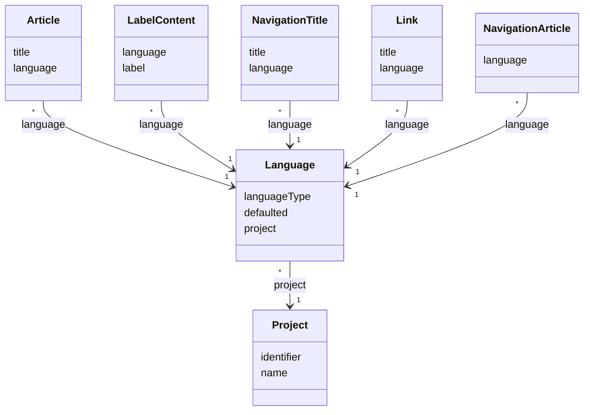

# TN0302 Language

A **Language** is one language enabled for a [Project](TN0301_project.md). Each language row
binds a `LanguageType` enum value to a project, and exactly one language per project carries
`defaulted = true` — that language is the project's default. The language rows themselves hold
no text: all per-language content is stored in the models that reference a language —
[Article](TN0501_article.md), the `LabelContent` side of [Label](TN0303_label.md),
[Navigation Title](TN0602_navigation_title.md), [Link](TN0503_link.md), and
[Navigation Article](TN0603_navigation_article.md).

## Code mapping

| Entity class | DB table | Source |
|---|---|---|
| `Language` | `pager_language` | [Language.kt](/source/pager-backend/domain/src/main/kotlin/com/xwkj/pager/domain/model/database/Language.kt) |
| `LanguageType` (enum) | — (stored as string via `@Enumerated(EnumType.STRING)`) | [LanguageType.kt](/source/pager-backend/domain/src/main/kotlin/com/xwkj/pager/domain/model/enum/LanguageType.kt) |

## Important fields

| Field | Type | Description |
|---|---|---|
| `id` | `Long?` | Primary key (auto-generated). |
| `createAt` | `Long` | Creation timestamp (epoch milliseconds). |
| `languageType` | `LanguageType` | Which language this row enables (see the value table below). |
| `defaulted` | `Boolean` | Whether this is the project's default language; exactly one language per project is `defaulted`. |
| `project` | `Project` | `@ManyToOne`, join column `project_id` — the owning [Project](TN0301_project.md). |

### `languageType` — enum `LanguageType`

Each value carries a Java `locale` and a `languageName` display string (a literal Chinese string
value in the code):

| Value | `locale` | `languageName` | Gloss of `languageName` |
|---|---|---|---|
| `SIMPLIFIED_CHINESE` | `Locale.SIMPLIFIED_CHINESE` | `简体中文` | Simplified Chinese |
| `TRADITIONAL_CHINESE` | `Locale.TRADITIONAL_CHINESE` | `繁体中文` | Traditional Chinese |
| `ENGLISH` | `Locale.ENGLISH` | `英语` | English |
| `FRENCH` | `Locale.FRENCH` | `法语` | French |
| `GERMAN` | `Locale.GERMAN` | `日语` | Japanese |
| `ITALIAN` | `Locale.ITALIAN` | `意大利语` | Italian |
| `JAPANESE` | `Locale.JAPANESE` | `西班牙语` | Spanish |
| `KOREAN` | `Locale.KOREAN` | `韩语` | Korean |

Note: as implemented, some `languageName` display values do not match their locale — `GERMAN`
carries `日语` (the display name meaning "Japanese") and `JAPANESE` carries `西班牙语` (the
display name meaning "Spanish"); the values above are recorded verbatim from the source.

## Relationships

- **[Project](TN0301_project.md)** — referenced by `project` (join column `project_id`); many
  languages (`*`) belong to one (`1`) project, and exactly one of a project's languages is
  `defaulted`.
- **[Article](TN0501_article.md)** — `Article.language` (join column `language_id`) marks the
  language an article is written in; many articles (`*`) per language (`1`).
- **[Label](TN0303_label.md)** — `LabelContent.language` (join column `language_id`) selects
  which label content is used for the language; many label contents (`*`) per language (`1`).
- **[Navigation Title](TN0602_navigation_title.md)** — `NavigationTitle.language` (join column
  `language_id`) holds the per-language display title of a navigation node; many titles (`*`)
  per language (`1`).
- **[Link](TN0503_link.md)** — `Link.language` (join column `language_id`) marks the language of
  a link entry; many links (`*`) per language (`1`).
- **[Navigation Article](TN0603_navigation_article.md)** — `NavigationArticle.language` (join
  column `language_id`) scopes the article-to-navigation binding per language; many bindings
  (`*`) per language (`1`).

## Diagram

