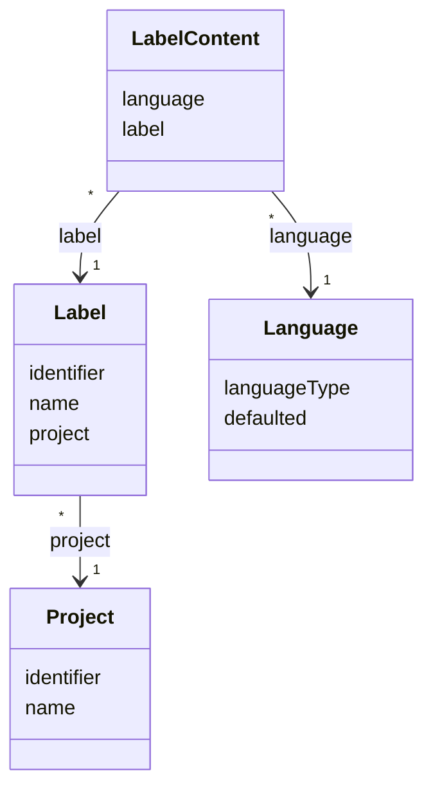

# TN0303 Label

A **Label** is a named, identifier-addressed content slot of a [Project](TN0301_project.md).
The label itself (`Label`) only defines the slot — its [Identifier](TN0101_identifier.md) and
display `name` — while the actual text lives in `LabelContent` rows, one per
[Language](TN0302_language.md). At deploy time the per-language content is substituted into the
project's templates by the tag-precompile step of the deployment — the substitution mechanism is
the [Pager Tag](TN0403_pager_tag.md); the tag syntax is defined in the
[template tag reference](../../plan/common/template-tags.md).

## Code mapping

| Entity class | DB table | Source |
|---|---|---|
| `Label` | `pager_label` | [Label.kt](/source/pager-backend/domain/src/main/kotlin/com/xwkj/pager/domain/model/database/Label.kt) |
| `LabelContent` | `pager_label_content` | [LabelContent.kt](/source/pager-backend/domain/src/main/kotlin/com/xwkj/pager/domain/model/database/LabelContent.kt) |

## Important fields

### `Label` (`pager_label`)

| Field | Type | Description |
|---|---|---|
| `id` | `Long?` | Primary key (auto-generated). |
| `createAt` | `Long` | Creation timestamp (epoch milliseconds). |
| `updateAt` | `Long` | Last-update timestamp (epoch milliseconds). |
| `identifier` | `String` | The stable machine-readable key of the label — see [Identifier](TN0101_identifier.md); the `id` a template tag addresses the slot by. |
| `name` | `String` | Display name of the label. |
| `project` | `Project` | `@ManyToOne` — the owning [Project](TN0301_project.md); mapped with `@JoinColumn(nullable = false, name = "language_id")`. |

Note: as implemented, the field `project: Project` on `Label` is mapped to the join column named
`language_id` — the column name does not match the referenced entity; it is recorded verbatim
from the source.

### `LabelContent` (`pager_label_content`)

| Field | Type | Description |
|---|---|---|
| `id` | `Long?` | Primary key (auto-generated). |
| `createAt` | `Long` | Creation timestamp (epoch milliseconds). |
| `updateAt` | `Long` | Last-update timestamp (epoch milliseconds). |
| `content` | `String` | The text substituted into templates; column definition `LONGTEXT`. |
| `language` | `Language` | `@ManyToOne`, join column `language_id` — the [Language](TN0302_language.md) this content is for. |
| `label` | `Label` | `@ManyToOne`, join column `label_id` — the label (slot) this content fills. |

## Relationships

- **[Project](TN0301_project.md)** — referenced by `Label.project` (join column `language_id`;
  see the note above); many labels (`*`) belong to one (`1`) project.
- **[Language](TN0302_language.md)** — referenced by `LabelContent.language` (join column
  `language_id`); many label contents (`*`) per language (`1`). One content row per
  label-and-language pair holds the text used when the site is rendered in that language.
- **`LabelContent` → `Label`** — referenced by `LabelContent.label` (join column `label_id`);
  many contents (`*`) belong to one (`1`) label — one per enabled language of the project.
- **[Pager Tag](TN0403_pager_tag.md)** — the deploy-time precompile resolves a tag that
  addresses the label by its `identifier` and substitutes the matching per-language
  `LabelContent.content` into the generated pages (syntax:
  [template tag reference](../../plan/common/template-tags.md)).

## Diagram

