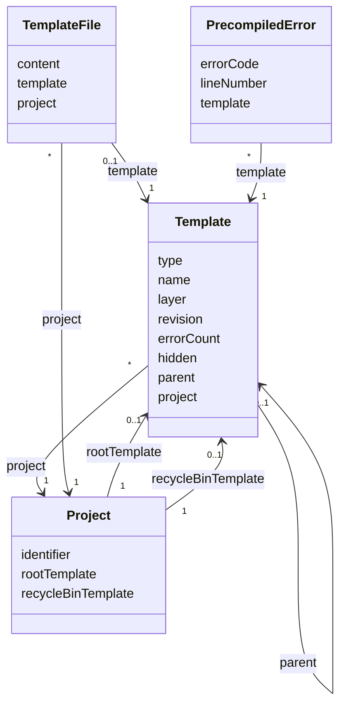

# TN0401 Template

A **Template** is one node of a project's site file tree: a directory or a file (HTML page,
CSS, JS, image, audio, video, …) managed in the CMS template editor and rendered to the static
site at deploy time. Every node carries its `parent` reference and `layer` (depth), so the whole
tree is stored as one self-referencing table. Two special node types exist per
[Project](TN0301_project.md): the `ROOT` node (referenced by `Project.rootTemplate`) under which
the site tree hangs, and the `RECYCLE_BIN` node (referenced by `Project.recycleBinTemplate`)
that holds deleted nodes. HTML templates may contain [Pager Tags](TN0403_pager_tag.md), whose
syntax problems are counted into the template's `errorCount`.

## Code mapping

| Code | Kind | DB table | Source |
|---|---|---|---|
| `Template` | JPA entity | `pager_template` | [Template.kt](/source/pager-backend/domain/src/main/kotlin/com/xwkj/pager/domain/model/database/Template.kt) |
| `TemplateType` | enum, persisted as string in column `type` | — | [TemplateType.kt](/source/pager-backend/domain/src/main/kotlin/com/xwkj/pager/domain/model/enum/TemplateType.kt) |
| `DeployType` | enum, computed (not persisted) | — | [DeployType.kt](/source/pager-backend/domain/src/main/kotlin/com/xwkj/pager/domain/model/enum/DeployType.kt) |

## Important fields

| Field | Type | Description |
|---|---|---|
| `type` | `TemplateType` | The node kind; see the value table below. Stored as a string (`@Enumerated(EnumType.STRING)`). |
| `name` | `String` | File or directory name, extension included (e.g. `index.html`). |
| `layer` | `Int` | Depth of the node in the tree; used to sort the ancestor chain. |
| `revision` | `Long` | Per-node change counter, compared against the project's staging / production revision to decide what a deployment must re-render — see [Revision](TN0102_revision.md). |
| `errorCount` | `Int` | Number of tag-syntax errors recorded for this template during precompile — see [Precompiled Error](TN0704_precompiled_error.md). |
| `hidden` | `Boolean` | Hidden flag. A `hidden` directory (like a directory whose `name` starts with `.`) is skipped by the deploy scan, so its subtree is not deployed. |
| `parent` | `Template?` | FK `parent_template_id`, nullable — the containing directory node. |
| `project` | `Project` | FK `project_id` — the owning [Project](TN0301_project.md). |
| `createAt` / `updateAt` | `Long` | Creation / last-update timestamps. |

Computed (non-persisted) properties:

- `deployType: DeployType` — how the deployment worker handles the node; see the mapping below.
- `parents: List<Template>` — the ancestor chain up to and including the `ROOT` node, sorted by
  `layer`; `root: Template` returns that `ROOT` ancestor.
- `path: String` — the `/`-joined `name`s of `parents.drop(1)` (i.e. the ancestors below the
  `ROOT` node), with a trailing `/` when non-empty; empty string for nodes directly under the
  root. `pathname: String` is `path + name`.
- `nameWithoutExtension` / `nameExtension`, and `nameWithInsertSuffix(suffix)` /
  `pathnameWithInsertSuffix(suffix)` building `<name>-<suffix>.<extension>` — used to derive
  variant file names from a template's name.

### `type` — `TemplateType`

| Value | Meaning |
|---|---|
| `ROOT` | The single root node of a project's site file tree. |
| `RECYCLE_BIN` | The special node that holds deleted nodes. |
| `DIRECTORY` | An ordinary directory. |
| `HTML` | An `.html` page template. |
| `HTM` | An `.htm` page template. |
| `JS` | A JavaScript file. |
| `CSS` | A stylesheet. |
| `XML` | An XML file. |
| `JPG` / `JPEG` / `PNG` / `GIF` | Image files. |
| `MP3` | An audio file. |
| `MP4` | A video file. |
| `OTHER` | Any file whose extension is not recognized. |

The enum carries classifier properties used throughout the code:

| Property | `true` for |
|---|---|
| `isDirectory` | `ROOT`, `DIRECTORY` |
| `isFile` | every value except `ROOT`, `DIRECTORY`, `RECYCLE_BIN` |
| `isTextFile` | `HTML`, `HTM`, `CSS`, `JS`, `XML` |
| `isHtml` | `HTML`, `HTM` |
| `isBinaryFile` | `isFile && !isTextFile`, i.e. `JPG`, `JPEG`, `PNG`, `GIF`, `MP3`, `MP4`, `OTHER` |
| `isImage` | `JPG`, `JPEG`, `PNG`, `GIF` |
| `isAudio` | `MP3` |
| `isVideo` | `MP4` |

The factory `TemplateType.of(extension)` maps a lower-cased file-name extension to a value and
falls back to `OTHER`; `ROOT`, `RECYCLE_BIN`, and `DIRECTORY` are never produced from an
extension.

### `deployType` — `DeployType` (computed)

`deployType` is derived from `type` and selects the deployment behavior:

| `DeployType` value | Derived from `type` | Deployment behavior |
|---|---|---|
| `DIRECTORY` | `DIRECTORY` | The deploy scan recurses into the directory (skipped when `hidden` or dot-prefixed). |
| `HTML_TEMPLATE` | `HTML`, `HTM` | Precompiled pager tags are rendered (includes replaced, article-list pages generated) and the result is uploaded as text. |
| `PLAIN_TEXT` | other `isTextFile` values (`CSS`, `JS`, `XML`) | The stored text content is uploaded as-is. |
| `BINARY` | everything else | The binary object is uploaded, addressed by the UUID stored as the node's content — see [Template File](TN0402_template_file.md). |

Recorded verbatim: `ROOT` and `RECYCLE_BIN` are not matched explicitly by the mapping and fall
through to the `else` branch, evaluating to `BINARY`.

## Relationships

- [Project](TN0301_project.md) — `project` (`project_id`): many templates belong to one project
  (`*` → `1`). The project points back at the two special nodes via `Project.rootTemplate`
  (`root_template_id`) and `Project.recycleBinTemplate` (`recycle_bin_template_id`), both
  `@OneToOne` and nullable (`1` → `0..1`).
- **Template** (self-reference) — `parent` (`parent_template_id`): each node references its
  containing directory node (`*` → `0..1`); the chain is climbed until the `ROOT`-typed
  ancestor is reached.
- [Template File](TN0402_template_file.md) — `TemplateFile.template` (`template_id`): the stored
  content of a file node lives in a separate one-to-one row (`0..1` per template).
- [Precompiled Error](TN0704_precompiled_error.md) — `PrecompiledError.template` (`template_id`):
  tag-syntax errors found during precompile reference the template (`*` per template);
  `errorCount` surfaces their number on the node.
- [Precompiled Tag](TN0703_precompiled_tag.md) — each pager-tag occurrence extracted from an
  HTML template references the template (`template_id`, `*` per template).
- Rendering bindings — [Article List](TN0502_article_list.md) (`ArticleList.template`),
  [Navigation Article](TN0603_navigation_article.md) (`NavigationArticle.template`), and
  [Navigation List](TN0604_navigation_list.md) (`NavigationList.template`) each reference the
  HTML template used to render their pages (`*` → `1`).

## Diagram

