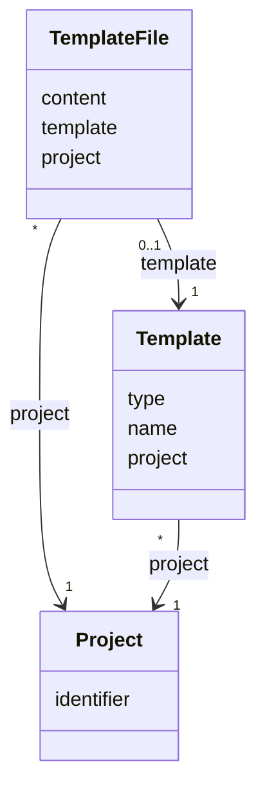

# TN0402 Template File

A **Template File** is the stored content of a file-typed [Template](TN0401_template.md) node —
the text edited in the online template editor. The body is kept in its own one-to-one row so the
`pager_template` tree table stays free of `LONGTEXT` payloads. For text-file nodes
(`TemplateType.isTextFile`) the `content` column holds the file's source text; for binary-file
nodes it holds a generated UUID that addresses the uploaded binary object in OSS instead of the
bytes themselves. Directory nodes have no Template File row.

## Code mapping

| Code | Kind | DB table | Source |
|---|---|---|---|
| `TemplateFile` | JPA entity | `pager_template_file` | [TemplateFile.kt](/source/pager-backend/domain/src/main/kotlin/com/xwkj/pager/domain/model/database/TemplateFile.kt) |

## Important fields

| Field | Type | Description |
|---|---|---|
| `content` | `String` | `LONGTEXT` column. The source text of a text-file node, or the UUID keying the OSS binary object of a binary-file node. Recorded verbatim: the column is declared `@Column(nullable = true)` while the Kotlin property type is non-nullable `String`. |
| `template` | `Template` | FK `template_id`, `@OneToOne`, non-null — the owning [Template](TN0401_template.md) node. |
| `project` | `Project` | FK `project_id`, `@ManyToOne`, non-null — the owning [Project](TN0301_project.md), in addition to the project reachable through `template.project`. |
| `createAt` / `updateAt` | `Long` | Creation / last-update timestamps. |

No enum-typed fields exist on this entity.

## Relationships

- [Template](TN0401_template.md) — `template` (`template_id`): one-to-one; each Template File
  belongs to exactly one template node (`1`), and a template node has at most one Template File
  (`0..1`) — directory nodes have none.
- [Project](TN0301_project.md) — `project` (`project_id`): many Template Files belong to one
  project (`*` → `1`).
- At deploy time the `content` of an HTML node is the input for
  [Pager Tag](TN0403_pager_tag.md) precompilation and page generation; `PLAIN_TEXT` nodes are
  uploaded as-is, and `BINARY` nodes are uploaded from the OSS object addressed by the stored
  UUID (see the `deployType` mapping in [Template](TN0401_template.md)).

## Diagram

