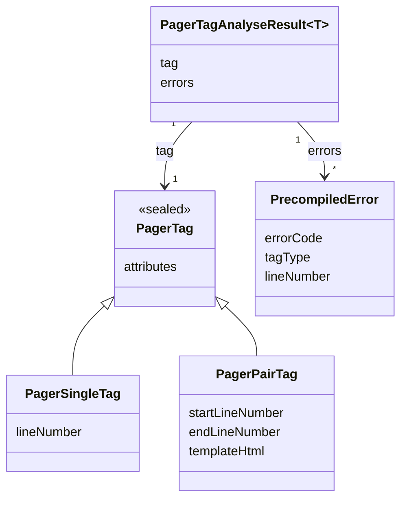

# TN0403 Pager Tag

A **Pager Tag** is a directive written inside an HTML [Template](TN0401_template.md) and
substituted when the site is deployed. Two kinds exist: `{pager:*}` **block directives**
(optionally paired with a closing `{/pager:*}`) that delimit or iterate a region, and the
`[list:*]` / `[page:*]` / `{content:*}` **placeholders** replaced by single values inside those
regions. The full syntax is defined in the
[template tag reference](../../plan/common/template-tags.md) and is not repeated here; this noun
covers the backend model. Only the block directives are enumerated by `TagType` — the
placeholders are substitution markers with no enum value of their own. During precompile, block
directives are extracted from the HTML as in-memory `PagerTag` values and persisted as
[Precompiled Tag](TN0703_precompiled_tag.md) rows; syntax problems are persisted as
[Precompiled Error](TN0704_precompiled_error.md) rows.

## Code mapping

| Code | Kind | DB table | Source |
|---|---|---|---|
| `TagType` | enum | — | [TagType.kt](/source/pager-backend/domain/src/main/kotlin/com/xwkj/pager/domain/model/enum/TagType.kt) |
| `PagerTag` (sealed), `PagerSingleTag`, `PagerPairTag` | in-memory model (not persisted) | — | [PagerTag.kt](/source/pager-backend/domain/src/main/kotlin/com/xwkj/pager/domain/model/pager/PagerTag.kt) |
| `PagerTagAnalyseResult<T>`, `PagerTagsAnalyseResult<T>` | in-memory model (not persisted) | — | [PagerTagAnalyseResult.kt](/source/pager-backend/domain/src/main/kotlin/com/xwkj/pager/domain/model/pager/PagerTagAnalyseResult.kt) |

## Important fields

### `TagType`

Each value carries a `value: String` — the tag name written after `pager:` in the template.

| Value | `value` | Tag in a template | Description |
|---|---|---|---|
| `LIST` | `"list"` | `{pager:list id="…"}` … `{/pager:list}` | Iterates an [Article List](TN0502_article_list.md), addressed by its identifier. |
| `PAGE_BAR` | `"pagebar"` | `{pager:pagebar size="…"}` … `{/pager:pagebar}` | Delimits the pagination-bar region of an article-list page. |
| `PAGE_LINK` | `"pagelink"` | `{pager:pagelink …}` … `{/pager:pagelink}` | Iterates the page links of a custom pagination bar. |
| `INCLUDE` | `"include"` | `{pager:include …}` | Includes another template fragment. |
| `NAVIGATION_MENU` | `"navmenu"` | `{pager:navmenu …}` | Renders a navigation menu. |
| `NAVIGATION_LIST` | `"navlist"` | `{pager:navlist …}` | Renders a navigation list. |

Recorded verbatim from the source, the enum carries the constraint comment
`// value cannot be start with same string like aa and aabb!!!` — no `value` may be a prefix of
another, because the regexes below match the tag name fuzzily (`pager:<value>` followed by
anything), so a value that prefixes another would also match the longer tag.

**Single-tag vs paired-tag forms.** A tag occurrence is either a self-closing *single tag* or a
*paired tag* (start + end delimiter). `TagType` provides one regex per form (source comments
quoted verbatim):

| Member | Pattern | Matches |
|---|---|---|
| `singleTagRegex` | `\{\/?pager:$value.*\/\}` | Fuzzy matching for a single tag like `{pager:xxx yyy="zzz"/}`. |
| `pairedTagRegex` | `\{\/?pager:$value.*\}` | Fuzzy matching for either delimiter of a paired tag: `{pager:xxx yyy="zzz"}` / `{/pager:xxx}`. |
| `isStartTag(string)` | exact match of `\{pager:$value.*\}` | The start delimiter `{pager:xxx yyy="zzz"}`. |
| `isEndTag(string)` | exact match of `\{\/pager:$value}` | The end delimiter `{/pager:xxx}`. |

### `PagerTag` models

| Model | Fields | Description |
|---|---|---|
| `PagerTag` (sealed base) | `attributes: Map<String, String>` | The parsed `key="value"` attributes of the tag, with typed accessors `stringValue`, `intValue`, `intValueWithDefault`, and `booleanValueWithDefault` (the boolean accessor returns `null` for a value that is neither `"true"` nor `"false"`). |
| `PagerSingleTag` | `lineNumber`, `originalHtml`, `attributes` | One self-closing tag occurrence and the line it was found on. |
| `PagerPairTag` | `startLineNumber`, `endLineNumber`, `originalHtml`, `templateHtml`, `attributes` | One paired-tag occurrence: `originalHtml` is the block as written in the template, `templateHtml` the inner HTML reused as the per-item render template. |
| `PagerTagAnalyseResult<T: PagerTag>` | `tag: T`, `errors: List<PrecompiledError>` | The outcome of analysing one tag, carrying the errors to be recorded. |
| `PagerTagsAnalyseResult<T: PagerTag>` | `tags: List<T>`, `errors: List<PrecompiledError>` | The outcome of analysing all occurrences of one tag type in a template. |

## Relationships

- Pager Tags are written inside HTML [Template](TN0401_template.md) nodes (`TemplateType.isHtml`,
  deploy type `HTML_TEMPLATE`); the tag source text is read from the node's
  [Template File](TN0402_template_file.md).
- Extracted occurrences are persisted per template as
  [Precompiled Tag](TN0703_precompiled_tag.md) rows, storing the original HTML and the render
  template for page generation.
- Analysis errors are persisted as [Precompiled Error](TN0704_precompiled_error.md) rows (which
  record the `tagType` and `lineNumber`) and surface as the template's `errorCount`.
- The `id` attribute of a `{pager:list}` tag names an [Article List](TN0502_article_list.md) by
  its [Identifier](TN0101_identifier.md).

## Diagram

