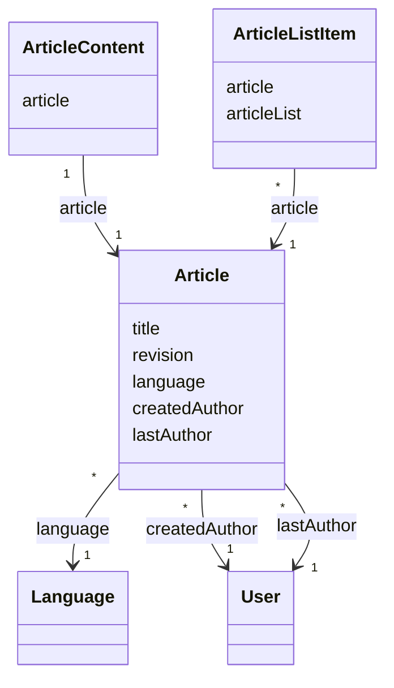

# TN0501 Article

An **Article** is an authored content piece of the CMS: a title, a description, an optional
cover image, and a body written in one [Language](TN0302_language.md). The metadata row
(`pager_article`) and the body (`pager_article_content`, a `LONGTEXT` column) are stored as two
separate entities joined one-to-one, so listing articles never loads the heavy body. Each article
tracks the [User](TN0202_user.md) who created it (`createdAuthor`) and the user who last edited
it (`lastAuthor`), and carries a [Revision](TN0102_revision.md) counter so deployments can detect
changes. An article has **no direct project reference** — it reaches a project's pages only
through membership in an [Article List](TN0502_article_list.md) (via `ArticleListItem`).

## Code mapping

| Entity class | DB table | Source |
|---|---|---|
| `Article` | `pager_article` | [Article.kt](/source/pager-backend/domain/src/main/kotlin/com/xwkj/pager/domain/model/database/Article.kt) |
| `ArticleContent` | `pager_article_content` | [ArticleContent.kt](/source/pager-backend/domain/src/main/kotlin/com/xwkj/pager/domain/model/database/ArticleContent.kt) |

## Important fields

### `Article`

| Field | Type | Description |
|---|---|---|
| `id` | `Long?` | Primary key (auto-increment). |
| `createAt` | `Long` | Creation timestamp, epoch milliseconds. The field is named `createAt` (not `createdAt`) verbatim in code. |
| `updateAt` | `Long` | Last-update timestamp, epoch milliseconds. |
| `title` | `String` | Article title. |
| `description` | `String` | Short description / summary shown in lists. |
| `cover` | `String?` | Cover image reference; nullable — an article may have no cover. |
| `revision` | `Long` | Per-model change counter compared at deploy time (see [Revision](TN0102_revision.md)). |
| `language` | `Language` | `@ManyToOne` → `language_id`; the single language the article is written in (see [Language](TN0302_language.md)). |
| `createdAuthor` | `User` | `@ManyToOne` → `created_author_user_id`; the user who created the article. |
| `lastAuthor` | `User` | `@ManyToOne` → `last_author_user_id`; the user who last edited the article. |

### `ArticleContent`

| Field | Type | Description |
|---|---|---|
| `id` | `Long?` | Primary key (auto-increment). |
| `content` | `String` | The article body, stored as `LONGTEXT`. |
| `article` | `Article` | `@OneToOne` → `article_id`; the owning article (exactly one content row per article). |

## Relationships

- [Language](TN0302_language.md) — `Article.language` (`language_id`), many-to-one: each
  article is written in exactly one language; one language has many articles.
- [User](TN0202_user.md) — `Article.createdAuthor` (`created_author_user_id`), many-to-one:
  the creating author.
- [User](TN0202_user.md) — `Article.lastAuthor` (`last_author_user_id`), many-to-one: the
  last editor. Two independent references to `User` are kept; they may point at the same user.
- `ArticleContent` — `ArticleContent.article` (`article_id`), one-to-one: the body row that
  belongs to this article. The reference is owned by the content side.
- [Article List](TN0502_article_list.md) — indirect, via `ArticleListItem.article`: an article
  is placed on lists through membership rows; the article itself holds no project or list
  reference (see [Project](TN0301_project.md) for the project side).

## Diagram

`ArticleListItem` and its `articleList` side are defined in
[Article List](TN0502_article_list.md).
