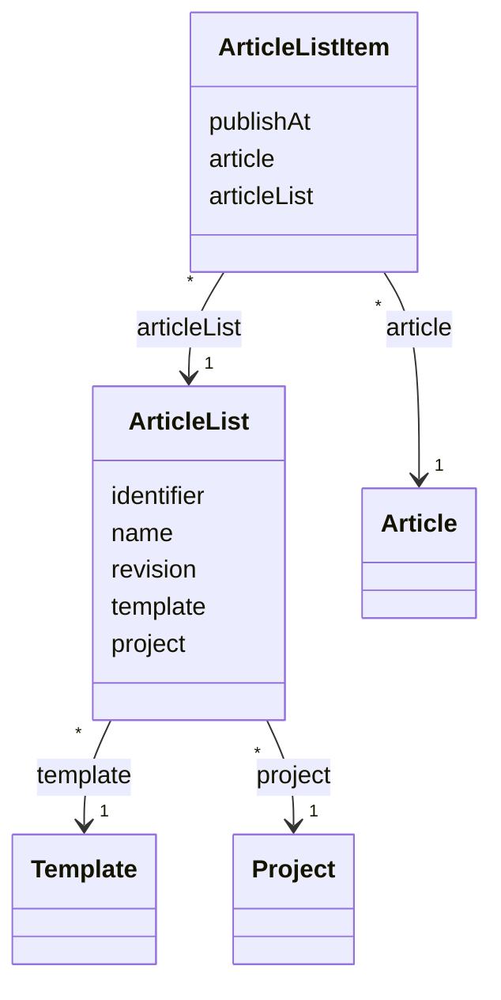

# TN0502 Article List

An **Article List** is a named, identifier-addressed collection of articles belonging to one
[Project](TN0301_project.md) and bound to one rendering [Template](TN0401_template.md).
Articles are not attached to the list directly: each membership is an `ArticleListItem` row
carrying a `publishAt` timestamp, which orders and dates the article inside the list. Pages pull
a list in with the `{pager:list id="…"}` tag, where `id` is the list's
[Identifier](TN0101_identifier.md) (see [Pager Tag](TN0403_pager_tag.md) and the
[template tag reference](../../plan/common/template-tags.md)). The bound template defines how
each entry is rendered at deploy time, and the list's [Revision](TN0102_revision.md) counter
tells a deployment whether the list must be re-rendered.

## Code mapping

| Entity class | DB table | Source |
|---|---|---|
| `ArticleList` | `pager_article_list` | [ArticleList.kt](/source/pager-backend/domain/src/main/kotlin/com/xwkj/pager/domain/model/database/ArticleList.kt) |
| `ArticleListItem` | `pager_article_list_item` | [ArticleListItem.kt](/source/pager-backend/domain/src/main/kotlin/com/xwkj/pager/domain/model/database/ArticleListItem.kt) |

## Important fields

### `ArticleList`

| Field | Type | Description |
|---|---|---|
| `id` | `Long?` | Primary key (auto-increment). |
| `createAt` | `Long` | Creation timestamp, epoch milliseconds. |
| `updateAt` | `Long` | Last-update timestamp, epoch milliseconds. |
| `identifier` | `String` | Machine-readable key referenced by `{pager:list id="…"}` (see [Identifier](TN0101_identifier.md)). |
| `name` | `String` | Human-readable display name. |
| `revision` | `Long` | Per-model change counter compared at deploy time (see [Revision](TN0102_revision.md)). |
| `template` | `Template` | `@ManyToOne` → `template_id`; the template used to render the list's entries (see [Template](TN0401_template.md)). |
| `project` | `Project` | `@ManyToOne` → `project_id`; the owning project (see [Project](TN0301_project.md)). |

### `ArticleListItem`

| Field | Type | Description |
|---|---|---|
| `id` | `Long?` | Primary key (auto-increment). |
| `publishAt` | `Long` | Publish timestamp of the article inside this list, epoch milliseconds. |
| `article` | `Article` | `@ManyToOne` → `article_id`; the member article (see [Article](TN0501_article.md)). |
| `articleList` | `ArticleList` | `@ManyToOne` → `article_list_id`; the list the article is placed on. |

## Relationships

- [Project](TN0301_project.md) — `ArticleList.project` (`project_id`), many-to-one: each list
  belongs to exactly one project; a project has many article lists.
- [Template](TN0401_template.md) — `ArticleList.template` (`template_id`), many-to-one: the
  rendering template of the list. (Note: the sibling [Link List](TN0504_link_list.md) has no
  such template reference.)
- [Article](TN0501_article.md) — via `ArticleListItem`: `ArticleListItem.articleList`
  (`article_list_id`) and `ArticleListItem.article` (`article_id`) form the many-to-many
  membership between lists and articles, each membership dated by `publishAt`.
- [Pager Tag](TN0403_pager_tag.md) — pages reference the list with `{pager:list id="…"}`
  matched against `identifier`; the rendered output is also driven by `[list:*]` placeholders
  (see the [template tag reference](../../plan/common/template-tags.md)).

## Diagram

