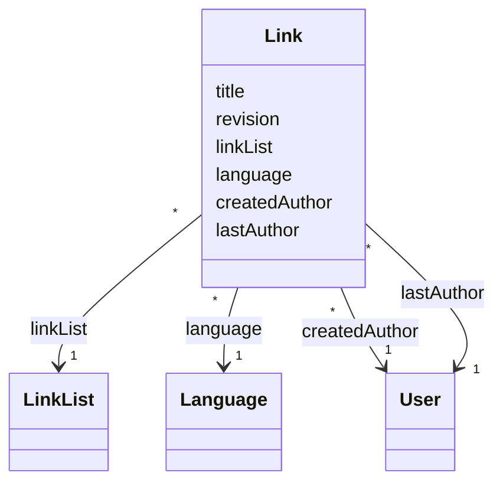

# TN0503 Link

A **Link** is an external hyperlink entry managed in the CMS: an `href` URL, a title, and an
optional cover image, written in one [Language](TN0302_language.md). Unlike an
[Article](TN0501_article.md), a link has no separate body/content entity — the `href` itself
(stored as `LONGTEXT`) is the payload — and its list membership is a **direct** reference: each
link belongs to exactly one [Link List](TN0504_link_list.md) via `linkList`, with no join entity
and no per-membership publish timestamp. Like an article, a link tracks `createdAuthor` /
`lastAuthor` ([User](TN0202_user.md)) and a [Revision](TN0102_revision.md) counter, and holds no
direct project reference — the project is reached through the owning link list.

## Code mapping

| Entity class | DB table | Source |
|---|---|---|
| `Link` | `pager_link` | [Link.kt](/source/pager-backend/domain/src/main/kotlin/com/xwkj/pager/domain/model/database/Link.kt) |

## Important fields

| Field | Type | Description |
|---|---|---|
| `id` | `Long?` | Primary key (auto-increment). |
| `createAt` | `Long` | Creation timestamp, epoch milliseconds. |
| `updateAt` | `Long` | Last-update timestamp, epoch milliseconds. |
| `href` | `String` | The hyperlink target URL, stored as `LONGTEXT`. |
| `title` | `String` | Display title of the link. |
| `cover` | `String?` | Cover image reference; nullable — a link may have no cover. |
| `revision` | `Long` | Per-model change counter compared at deploy time (see [Revision](TN0102_revision.md)). |
| `createdAuthor` | `User` | `@ManyToOne` → `created_author_user_id`; the user who created the link. |
| `lastAuthor` | `User` | `@ManyToOne` → `last_author_user_id`; the user who last edited the link. |
| `linkList` | `LinkList` | `@ManyToOne` → `link_list_id`; the owning list (see [Link List](TN0504_link_list.md)). |
| `language` | `Language` | `@ManyToOne` → `language_id`; the single language of the link (see [Language](TN0302_language.md)). |

## Relationships

- [Link List](TN0504_link_list.md) — `Link.linkList` (`link_list_id`), many-to-one: each link
  belongs to exactly one link list; a list has many links. There is no join entity — contrast
  with `ArticleListItem` on [Article List](TN0502_article_list.md).
- [Language](TN0302_language.md) — `Link.language` (`language_id`), many-to-one: the language
  the link entry is written in.
- [User](TN0202_user.md) — `Link.createdAuthor` (`created_author_user_id`), many-to-one: the
  creating author.
- [User](TN0202_user.md) — `Link.lastAuthor` (`last_author_user_id`), many-to-one: the last
  editor. Two independent references to `User` are kept; they may point at the same user.

## Diagram

