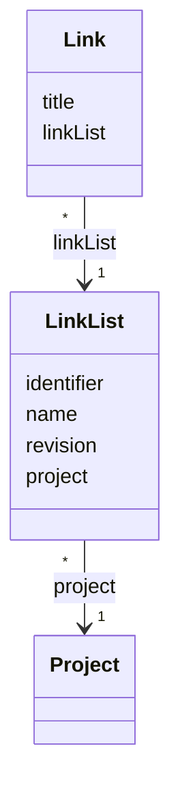

# TN0504 Link List

A **Link List** is a named, identifier-addressed list of [Link](TN0503_link.md) entries
belonging to one [Project](TN0301_project.md). The `identifier` is the machine-readable key by
which the list is addressed (see [Identifier](TN0101_identifier.md)), and the
[Revision](TN0102_revision.md) counter tells a deployment whether the list must be re-rendered.
Note, verbatim from the entity: **unlike `ArticleList`, `LinkList` has no `template` reference**
— the entity carries only `identifier`, `name`, `revision`, and `project`. Links attach to the
list directly through `Link.linkList` (there is no join entity such as `ArticleListItem`).

## Code mapping

| Entity class | DB table | Source |
|---|---|---|
| `LinkList` | `pager_link_list` | [LinkList.kt](/source/pager-backend/domain/src/main/kotlin/com/xwkj/pager/domain/model/database/LinkList.kt) |

## Important fields

| Field | Type | Description |
|---|---|---|
| `id` | `Long?` | Primary key (auto-increment). |
| `createAt` | `Long` | Creation timestamp, epoch milliseconds. |
| `updateAt` | `Long` | Last-update timestamp, epoch milliseconds. |
| `identifier` | `String` | Machine-readable key of the list (see [Identifier](TN0101_identifier.md)). |
| `name` | `String` | Human-readable display name. |
| `revision` | `Long` | Per-model change counter compared at deploy time (see [Revision](TN0102_revision.md)). |
| `project` | `Project` | `@ManyToOne` → `project_id`; the owning project (see [Project](TN0301_project.md)). |

## Relationships

- [Project](TN0301_project.md) — `LinkList.project` (`project_id`), many-to-one: each link list
  belongs to exactly one project; a project has many link lists.
- [Link](TN0503_link.md) — inverse of `Link.linkList` (`link_list_id`), one-to-many: a list
  holds many links, each link belonging to exactly one list.
- [Article List](TN0502_article_list.md) — sibling concept for articles; `ArticleList`
  additionally references a rendering [Template](TN0401_template.md), which `LinkList` does not.
- [Pager Tag](TN0403_pager_tag.md) — link lists are consumed on pages through the pager-tag
  mechanism (see the [template tag reference](../../plan/common/template-tags.md)).

## Diagram

