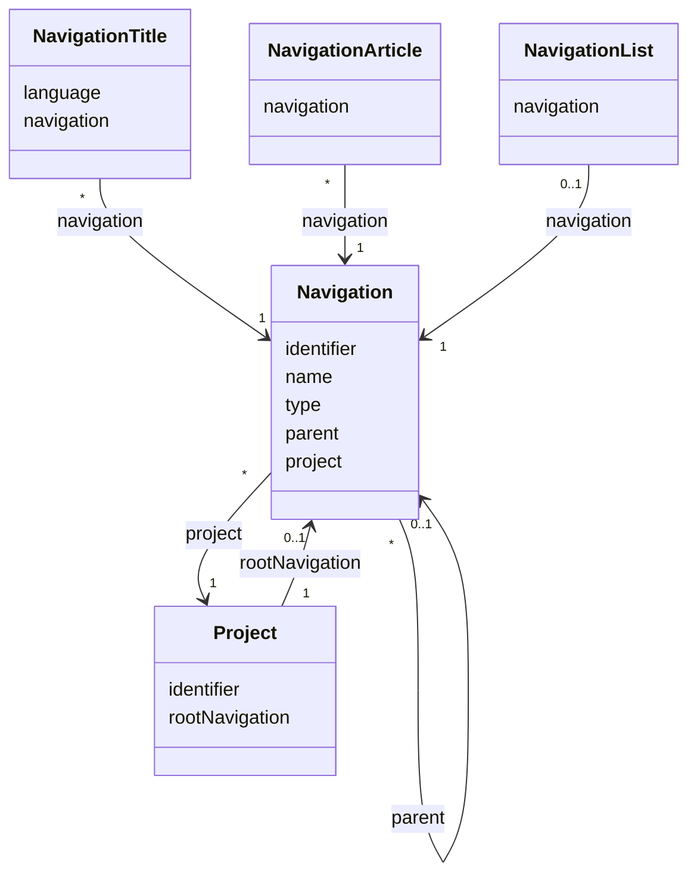

# TN0601 Navigation

A **Navigation** is one node of a project's menu / URL tree. The tree starts at a single
`ROOT` node (referenced back from the project as its `rootNavigation`); every other node is
either a `LIST` node (renders an article list) or an `ARTICLE` node (renders single articles).
Each node carries a display `name`, an [Identifier](TN0101_identifier.md) used as its URL path
segment, a `layer` (depth in the tree), and a `sequence` (order among siblings). The identifier
chain from the root down to a node forms the page path of the generated static page
(e.g. `aaa/bbb/index.html`).

## Code mapping

| Entity class | DB table | Source |
|---|---|---|
| `Navigation` | `pager_navigation` | [Navigation.kt](/source/pager-backend/domain/src/main/kotlin/com/xwkj/pager/domain/model/database/Navigation.kt) |
| `NavigationType` (enum, stored as string in the `type` column) | — | [NavigationType.kt](/source/pager-backend/domain/src/main/kotlin/com/xwkj/pager/domain/model/enum/NavigationType.kt) |

## Important fields

| Field | Type | Description |
|---|---|---|
| `id` | `Long?` | Primary key (auto-increment). |
| `createAt` | `Long` | Creation timestamp, epoch milliseconds. |
| `updateAt` | `Long` | Last-update timestamp, epoch milliseconds. |
| `type` | `NavigationType` | Node kind — see the value table below. Stored as a string (`@Enumerated(EnumType.STRING)`). |
| `sequence` | `Int` | Order of the node among its siblings. |
| `identifier` | `String` | The node's URL path segment — see [Identifier](TN0101_identifier.md). |
| `name` | `String` | Display name of the node inside the CMS. |
| `layer` | `Int` | Depth of the node in the tree; used to sort the ancestor chain. |
| `revision` | `Long` | Change counter compared against the project's deploy revisions — see [Revision](TN0102_revision.md). |
| `parent` | `Navigation?` | Self-reference to the parent node (join column `parent_navigation_id`, nullable). The `ROOT` node has no parent. |
| `project` | `Project` | Owning project (join column `project_id`). |

### `type` — `NavigationType`

| Value | Meaning |
|---|---|
| `ROOT` | The single top node of a project's navigation tree; not a page itself. It is referenced back from the project's `rootNavigation` field. |
| `LIST` | A node that renders an article list; bound to a list and a template by one [Navigation List](TN0604_navigation_list.md). |
| `ARTICLE` | A node that renders single articles; bound per language to an article and a template by [Navigation Article](TN0603_navigation_article.md) rows. |

### Computed path properties

Four read-only Kotlin properties (not database columns) derive the generated page path:

| Property | Value |
|---|---|
| `parents` | The ancestor chain of the node, walked up through `parent` until (and including) the `ROOT` node, sorted ascending by `layer` — so the `ROOT` node comes first. |
| `path` | The `identifier` values of `parents` with the first entry (the `ROOT` node) dropped, joined with `/`; empty for a node directly under the root, otherwise suffixed with a trailing `/`. |
| `pathIdentifier` | `path` + the node's own `identifier` (e.g. `aaa/bbb`). |
| `pathname` | `"$pathIdentifier/index.html"` — the object key of the generated page, e.g. `aaa/bbb/index.html` (each node is rendered as an `index.html` inside its own directory). |

## Relationships

- [Project](TN0301_project.md) — `project` (`@ManyToOne`, join column `project_id`): every
  navigation node belongs to exactly one project; a project has many nodes (`*`).
  In the opposite direction, `Project.rootNavigation` (`@OneToOne`, join column
  `root_navigation_id`, nullable) points at the tree's `ROOT` node (`0..1`).
- Navigation (self) — `parent` (`@ManyToOne`, join column `parent_navigation_id`, nullable):
  each node has `0..1` parent and any number (`*`) of children; siblings are ordered by
  `sequence`.
- [Navigation Title](TN0602_navigation_title.md) — referenced by `NavigationTitle.navigation`
  (`@ManyToOne`): one node has one display title per project language (`*`).
- [Navigation Article](TN0603_navigation_article.md) — referenced by
  `NavigationArticle.navigation` (`@ManyToOne`): an `ARTICLE` node is bound to one article and
  template per language (`*`).
- [Navigation List](TN0604_navigation_list.md) — referenced by `NavigationList.navigation`
  (`@OneToOne`): a `LIST` node is bound to exactly one article list and template (`0..1`).
- [Identifier](TN0101_identifier.md) — the `identifier` field is the node's URL path segment.
- [Revision](TN0102_revision.md) — the `revision` field is the node's change counter.

## Diagram

