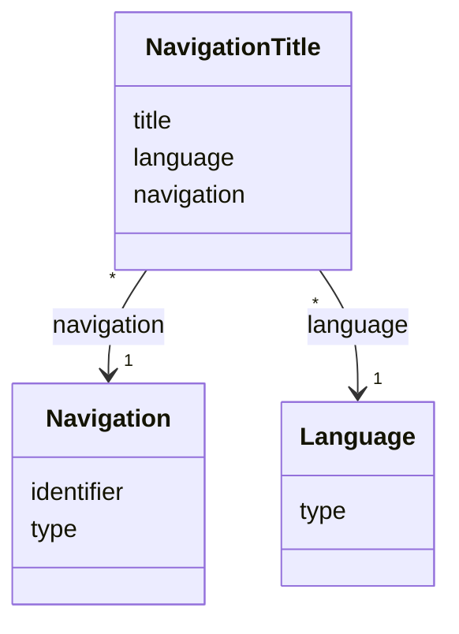

# TN0602 Navigation Title

A **Navigation Title** is the per-language display title of a [Navigation](TN0601_navigation.md)
node. The `Navigation` entity itself only carries a single internal `name`; the text actually
shown in the site's menus is stored here, one row per node per project
[Language](TN0302_language.md).

## Code mapping

| Entity class | DB table | Source |
|---|---|---|
| `NavigationTitle` | `pager_navigation_title` | [NavigationTitle.kt](/source/pager-backend/domain/src/main/kotlin/com/xwkj/pager/domain/model/database/NavigationTitle.kt) |

## Important fields

| Field | Type | Description |
|---|---|---|
| `id` | `Long?` | Primary key (auto-increment). |
| `createAt` | `Long` | Creation timestamp, epoch milliseconds. |
| `updateAt` | `Long` | Last-update timestamp, epoch milliseconds. |
| `title` | `String` | The display title shown for the navigation node in this language. |
| `language` | `Language` | The language this title is written in (join column `language_id`). |
| `navigation` | `Navigation` | The navigation node this title belongs to (join column `navigation_id`). |

No enum-typed fields are defined on this entity.

## Relationships

- [Navigation](TN0601_navigation.md) — `navigation` (`@ManyToOne`, join column
  `navigation_id`): each title belongs to exactly one node (`1`); a node has one title per
  enabled language (`*`).
- [Language](TN0302_language.md) — `language` (`@ManyToOne`, join column `language_id`): each
  title is written in exactly one language (`1`); a language is referenced by many titles (`*`).

## Diagram

