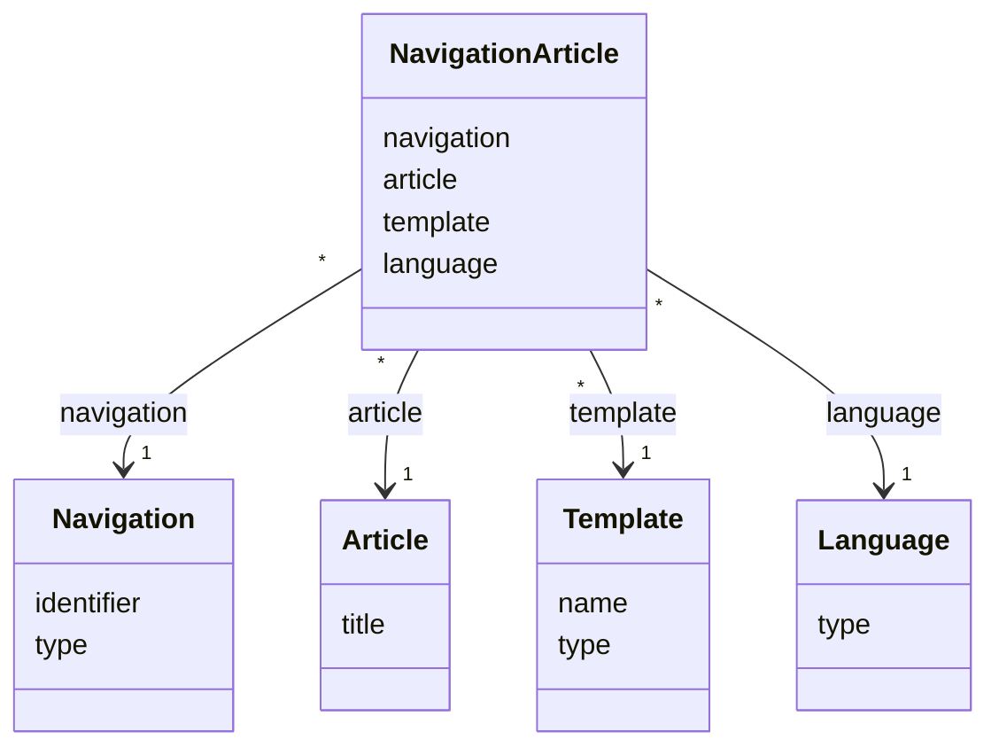

# TN0603 Navigation Article

A **Navigation Article** is the binding that renders one [Article](TN0501_article.md) on an
`ARTICLE`-type [Navigation](TN0601_navigation.md) node with a given
[Template](TN0401_template.md), per [Language](TN0302_language.md). At deploy time the article's
content is substituted into the bound template and written to the node's page path; one binding
row exists per node per language, so each language of the site can show a different article
and template on the same node.

## Code mapping

| Entity class | DB table | Source |
|---|---|---|
| `NavigationArticle` | `pager_navigation_article` | [NavigationArticle.kt](/source/pager-backend/domain/src/main/kotlin/com/xwkj/pager/domain/model/database/NavigationArticle.kt) |

## Important fields

| Field | Type | Description |
|---|---|---|
| `id` | `Long?` | Primary key (auto-increment). |
| `createAt` | `Long` | Creation timestamp, epoch milliseconds. |
| `updateAt` | `Long` | Last-update timestamp, epoch milliseconds. |
| `template` | `Template` | The template the article is rendered with. The `@JoinColumn(nullable = false)` on this field carries no explicit `name` attribute in the source (unlike the other references on this entity), so the column name falls back to the JPA default, `template_id`. Recorded as implemented. |
| `language` | `Language` | The language this binding applies to (join column `language_id`). |
| `article` | `Article` | The article rendered on the node (join column `article_id`). |
| `navigation` | `Navigation` | The `ARTICLE`-type navigation node being bound (join column `navigation_id`). |

No enum-typed fields are defined on this entity.

## Relationships

- [Navigation](TN0601_navigation.md) — `navigation` (`@ManyToOne`, join column
  `navigation_id`): each binding belongs to exactly one node (`1`); an `ARTICLE` node has one
  binding per enabled language (`*`). Note the contrast with
  [Navigation List](TN0604_navigation_list.md), where the same reference is `@OneToOne`.
- [Article](TN0501_article.md) — `article` (`@ManyToOne`, join column `article_id`): each
  binding renders exactly one article (`1`); an article can be bound to many nodes (`*`).
- [Template](TN0401_template.md) — `template` (`@ManyToOne`, default join column
  `template_id`): each binding renders through exactly one template (`1`); a template can be
  used by many bindings (`*`).
- [Language](TN0302_language.md) — `language` (`@ManyToOne`, join column `language_id`): each
  binding applies to exactly one language (`1`); a language is referenced by many bindings
  (`*`).

## Diagram

