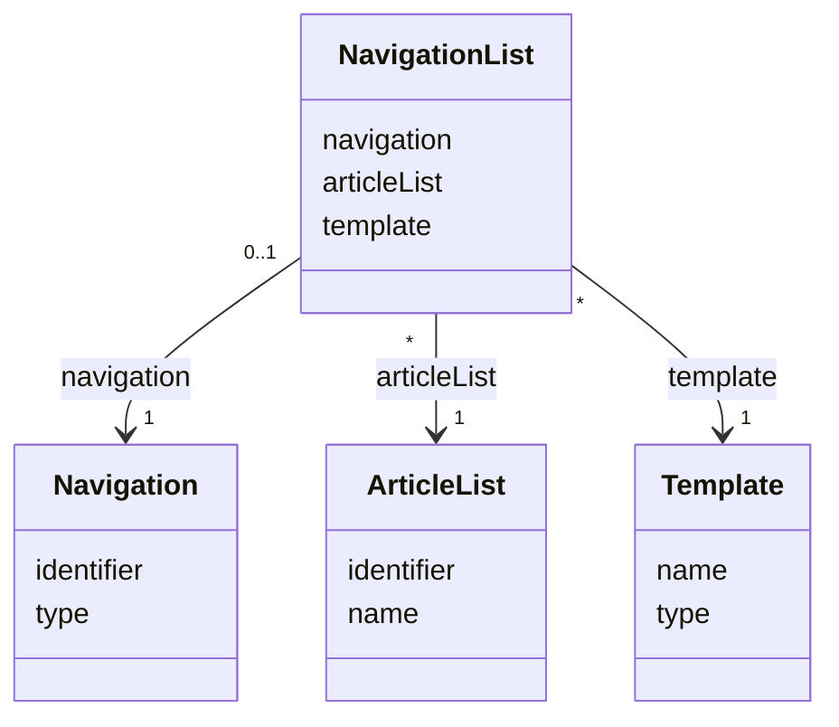

# TN0604 Navigation List

A **Navigation List** is the binding that renders an [Article List](TN0502_article_list.md) on a
`LIST`-type [Navigation](TN0601_navigation.md) node with a given
[Template](TN0401_template.md). At deploy time the list's items are rendered through the bound
template and written to the node's page path. Unlike
[Navigation Article](TN0603_navigation_article.md), this binding carries no language reference
and the navigation reference is `@OneToOne` — a `LIST` node has a single binding shared by all
languages.

## Code mapping

| Entity class | DB table | Source |
|---|---|---|
| `NavigationList` | `pager_navigation_list` | [NavigationList.kt](/source/pager-backend/domain/src/main/kotlin/com/xwkj/pager/domain/model/database/NavigationList.kt) |

## Important fields

| Field | Type | Description |
|---|---|---|
| `id` | `Long?` | Primary key (auto-increment). |
| `createAt` | `Long` | Creation timestamp, epoch milliseconds. |
| `updateAt` | `Long` | Last-update timestamp, epoch milliseconds. |
| `template` | `Template` | The template the list is rendered with. The `@JoinColumn(nullable = false)` on this field carries no explicit `name` attribute in the source (unlike the other references on this entity), so the column name falls back to the JPA default, `template_id`. Recorded as implemented. |
| `articleList` | `ArticleList` | The article list rendered on the node (join column `article_list_id`). |
| `navigation` | `Navigation` | The `LIST`-type navigation node being bound (`@OneToOne`, join column `navigation_id`). |

No enum-typed fields are defined on this entity.

## Relationships

- [Navigation](TN0601_navigation.md) — `navigation` (`@OneToOne`, join column
  `navigation_id`): each binding belongs to exactly one node (`1`), and a `LIST` node has at
  most one binding (`0..1`). Note this reference is `@OneToOne`, unlike the `@ManyToOne`
  per-language `navigation` reference on
  [Navigation Article](TN0603_navigation_article.md).
- [Article List](TN0502_article_list.md) — `articleList` (`@ManyToOne`, join column
  `article_list_id`): each binding renders exactly one article list (`1`); an article list can
  be bound to many nodes (`*`).
- [Template](TN0401_template.md) — `template` (`@ManyToOne`, default join column
  `template_id`): each binding renders through exactly one template (`1`); a template can be
  used by many bindings (`*`).

## Diagram

