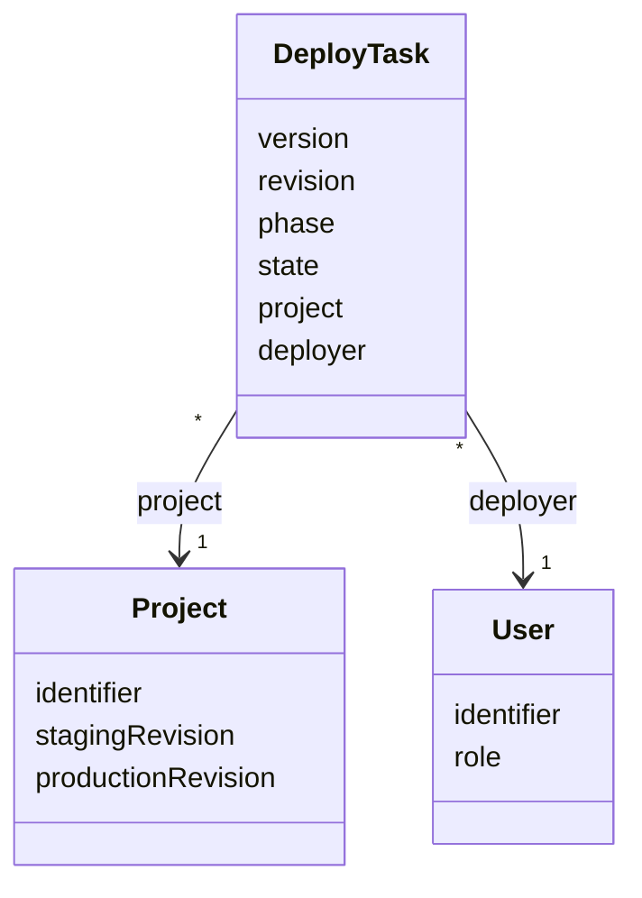

# TN0701 Deploy Task

A **Deploy Task** is one deployment run of a [Project](TN0301_project.md) to a phase —
`STAGING` or `PRODUCTION` — at a given [Revision](TN0102_revision.md), requested by a
[User](TN0202_user.md) (the `deployer`). A task is created in state `SUBMIT` by the CMS and is
processed asynchronously: the CMS publishes a `ProjectDeployMessage` over RabbitMQ, and the
consumer application picks it up and advances the task to a terminal state (`FINISH`,
`INTERRUPTED_BY_USER`, `INTERRUPTED_BY_ERRORS`, or `NOTHING_TO_DEPLOY`). The task's phase
selects which [Bucket](TN0702_bucket.md) the generated site is uploaded to.

## Code mapping

| Class | DB table | Source |
|---|---|---|
| `DeployTask` | `pager_deploy_task` | [DeployTask.kt](/source/pager-backend/domain/src/main/kotlin/com/xwkj/pager/domain/model/database/DeployTask.kt) |
| `DeployPhase` (enum) | — (stored as string via `@Enumerated(EnumType.STRING)`) | [DeployPhase.kt](/source/pager-backend/domain/src/main/kotlin/com/xwkj/pager/domain/model/enum/DeployPhase.kt) |
| `DeployState` (enum) | — (stored as string via `@Enumerated(EnumType.STRING)`) | [DeployState.kt](/source/pager-backend/domain/src/main/kotlin/com/xwkj/pager/domain/model/enum/DeployState.kt) |
| `PagerMessage` (marker interface) | — (RabbitMQ payloads, not persisted) | [PagerMessage.kt](/source/pager-backend/domain/src/main/kotlin/com/xwkj/pager/domain/model/message/PagerMessage.kt) |
| `ProjectDeployMessage` | — | [ProjectDeployMessage.kt](/source/pager-backend/domain/src/main/kotlin/com/xwkj/pager/domain/model/message/ProjectDeployMessage.kt) |
| `ProjectZipHandlerMessage` | — | [ProjectZipHandlerMessage.kt](/source/pager-backend/domain/src/main/kotlin/com/xwkj/pager/domain/model/message/ProjectZipHandlerMessage.kt) |

## Important fields

| Field | Type | Description |
|---|---|---|
| `id` | `Long?` | Primary key (auto-generated). Sent as `deployId` in `ProjectDeployMessage`. |
| `createAt` | `Long` | Creation timestamp (epoch milliseconds). |
| `updateAt` | `Long` | Last-update timestamp (epoch milliseconds). |
| `version` | `Long` | Sequence number of the task within its project and phase; set to the latest task's `version` plus one (`(latestDeploy?.version ?: 0) + 1` in `DeployService.deploy`, the latest task being fetched with `getTopByProjectAndPhaseOrderByVersionDesc`). |
| `revision` | `Long` | The [Revision](TN0102_revision.md) the deployment targets; set to the latest task's `revision` plus one on creation, and written back to the task when the consumer finishes. |
| `phase` | `DeployPhase` | The deployment target phase (see the value table below). |
| `state` | `DeployState` | The processing state of the task (see the value table below). |
| `project` | `Project` | `@ManyToOne`, join column `project_id` — the deployed [Project](TN0301_project.md). |
| `deployer` | `User` | `@ManyToOne`, join column `deployer_user_id` — the [User](TN0202_user.md) who requested the deployment. |
| `projectCurrentRevision` | `Long` (computed) | Derived property, not a column: selects the project's revision counter of the task's phase — `project.stagingRevision` for `STAGING`, `project.productionRevision` for `PRODUCTION`. Compared against `revision` by the consumer to decide what must be re-rendered. |

### `phase` — enum `DeployPhase`

Each phase maps to a `BucketType` of the `lib/oss` module through the computed `bucketType`
property (see [Bucket](TN0702_bucket.md)):

| Value | `bucketType` | Description |
|---|---|---|
| `STAGING` | `BucketType.STAGING` | Deployment to the project's staging bucket; tracked by `Project.stagingRevision`. |
| `PRODUCTION` | `BucketType.PRODUCTION` | Deployment to the project's production bucket; tracked by `Project.productionRevision`. |

### `state` — enum `DeployState`

| Value | Description |
|---|---|
| `SUBMIT` | Initial state; the task is saved and the RabbitMQ message is published. The consumer only accepts tasks in this state. |
| `SCANNING` | Declared as a deploying state; not assigned by any current code path (recorded verbatim). |
| `FINISH` | Terminal: the consumer completed all deploy steps and wrote the final `revision` back. |
| `INTERRUPTED_BY_USER` | Terminal: declared but not assigned by any current code path (recorded verbatim); a force deploy resets stuck tasks to `INTERRUPTED_BY_ERRORS`, not to this value. |
| `INTERRUPTED_BY_ERRORS` | Terminal: set by the consumer when any template of the project still has `errorCount > 0` (see [Precompiled Error](TN0704_precompiled_error.md)), and by `DeployService.forceDeploy` when resetting tasks that are stuck in a deploying state. |
| `NOTHING_TO_DEPLOY` | Terminal: the consumer computed an empty list of deploy steps — nothing changed since `projectCurrentRevision`. |

The companion set `DEPLOYING_STATES = setOf(SUBMIT, SCANNING)` backs the computed property
`isDeploying`; tasks in these states block a new regular deploy and are the ones reset by a
force deploy.

## Asynchronous processing

- On a deploy request, `DeployService.deploy` refuses if any template of the project has
  `errorCount > 0` (returning the error templates instead), otherwise saves the `DeployTask`
  with state `SUBMIT`, moves the project to `WAIT_FOR_DEPLOY`, and calls
  `RabbitMqComponent.sendProjectDeployMessage(deployId)`.
- `ProjectDeployMessage(deployId)` is published to the queue `q_project_deploy`
  (`RabbitMqConstant.PROJECT_DEPLOY_QUEUE`). The consumer's `ProjectConsumer` receives it and
  calls `ProjectDeployService.deploy(deployId)`, which renders the site and uploads it to the
  phase's [Bucket](TN0702_bucket.md).
- A second payload, `ProjectZipHandlerMessage(projectId, pathname)`, is published to the queue
  `q_zip_handler` (`RabbitMqConstant.ZIP_HANDLER_QUEUE`) for template-ZIP analysis and is
  handled by `ProjectZipHandlerService`. Both payloads implement the empty marker interface
  `PagerMessage` in `domain/.../model/message/`.

## Relationships

- **[Project](TN0301_project.md)** — referenced by `project` (join column `project_id`); many
  deploy tasks (`*`) belong to one (`1`) project. The computed `projectCurrentRevision` reads
  the project's `stagingRevision` / `productionRevision` depending on `phase`.
- **[User](TN0202_user.md)** — referenced by `deployer` (join column `deployer_user_id`); many
  deploy tasks (`*`) are requested by one (`1`) user.
- **[Bucket](TN0702_bucket.md)** — not a foreign key: `phase.bucketType` selects the OSS bucket
  the task deploys to, named from the project's identifier.
- **[Revision](TN0102_revision.md)** — `revision` and `projectCurrentRevision` implement the
  revision comparison that decides what a deployment must re-render.

## Diagram

