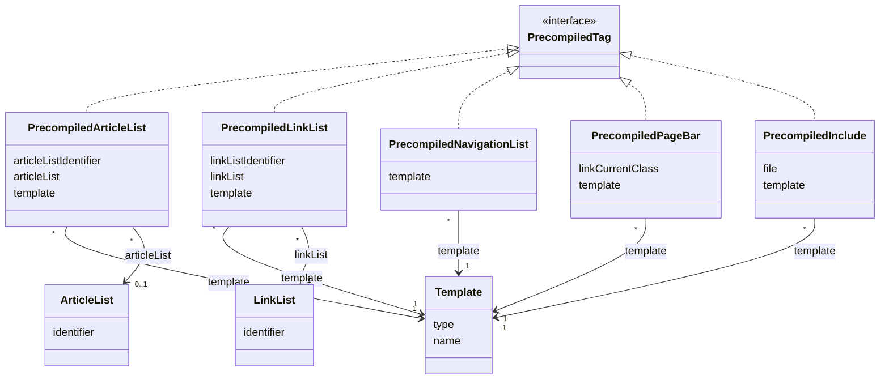

# TN0703 Precompiled Tag

A **Precompiled Tag** is one occurrence of a [Pager Tag](TN0403_pager_tag.md) extracted from an
HTML [Template](TN0401_template.md) during precompile. Each occurrence stores the tag's
`originalHtml` verbatim as it appears in the template file — so the occurrence can be located
and replaced at page-generation time — and, for paired tags, the inner `templateHtml` used as
the reusable render template. Five entity classes implement the marker interface
`PrecompiledTag`, one per tag kind. Precompiled tags are (re)extracted by
`PrecompileComponent.analyse(templateFile)`, which first deletes the template's existing rows
and records any [Precompiled Error](TN0704_precompiled_error.md)s found alongside them.

## Code mapping

| Class | DB table | Source |
|---|---|---|
| `PrecompiledTag` (interface) | — | [PrecompileTagAnalyseResult.kt](/source/pager-backend/domain/src/main/kotlin/com/xwkj/pager/domain/model/pager/PrecompileTagAnalyseResult.kt) |
| `PrecompiledArticleList` | `pager_precompiled_article_list` | [PrecompiledArticleList.kt](/source/pager-backend/domain/src/main/kotlin/com/xwkj/pager/domain/model/database/PrecompiledArticleList.kt) |
| `PrecompiledLinkList` | `pager_precompiled_link_list` | [PrecompiledLinkList.kt](/source/pager-backend/domain/src/main/kotlin/com/xwkj/pager/domain/model/database/PrecompiledLinkList.kt) |
| `PrecompiledNavigationList` | `pager_precompiled_navigation_list` | [PrecompiledNavigationList.kt](/source/pager-backend/domain/src/main/kotlin/com/xwkj/pager/domain/model/database/PrecompiledNavigationList.kt) |
| `PrecompiledPageBar` | `pager_precompiled_page_bar` | [PrecompiledPageBar.kt](/source/pager-backend/domain/src/main/kotlin/com/xwkj/pager/domain/model/database/PrecompiledPageBar.kt) |
| `PrecompiledInclude` | `pager_precompiled_include` | [PrecompiledInclude.kt](/source/pager-backend/domain/src/main/kotlin/com/xwkj/pager/domain/model/database/PrecompiledInclude.kt) |

`PrecompiledTag` is a **marker interface that defines no members** (`interface PrecompiledTag`).
It is declared in `PrecompileTagAnalyseResult.kt` under `model/pager` — not in
`model/database` where its implementations live (recorded verbatim). It serves as the type
bound of the analyse-result wrappers `PrecompileTagAnalyseResult<T: PrecompiledTag>` and
`PrecompileTagsAnalyseResult<T: PrecompiledTag>`, which pair the extracted tags with the
[Precompiled Error](TN0704_precompiled_error.md)s found during the same analysis.

## Important fields

Fields shared by the implementations:

| Field | Type | Description |
|---|---|---|
| `id` | `Long?` | Primary key (auto-generated). |
| `createAt` | `Long` | Creation timestamp (epoch milliseconds). |
| `originalHtml` | `String` (`LONGTEXT`) | The tag occurrence exactly as written in the template file; substituted with rendered output at deploy time. |
| `templateHtml` | `String` (`LONGTEXT`) | The render template — the HTML between the start and end markers of the paired tag. Present on all implementations **except** `PrecompiledInclude`. |
| `template` | `Template` | `@ManyToOne`, join column `template_id` (non-null) — the owning [Template](TN0401_template.md) node. |

Per-implementation specifics (tag syntax is defined in the
[template tag reference](../../plan/common/template-tags.md)):

| Entity | Tag (`TagType`) | Specific fields |
|---|---|---|
| `PrecompiledArticleList` | `LIST` (`{pager:list}`) | `articleListIdentifier: String`; `paging: Boolean`; `size: Int`; `articleList: ArticleList?` (`@ManyToOne`, join column `article_list_id`, nullable) — resolved from the tag's `id` attribute. |
| `PrecompiledLinkList` | — (see note below) | `linkListIdentifier: String`; `linkList: LinkList` (`@ManyToOne`, join column `link_list_id`). |
| `PrecompiledNavigationList` | `NAVIGATION_LIST` (`{pager:navlist}`) | `paging: Boolean`; `size: Int`. |
| `PrecompiledPageBar` | `PAGE_BAR` (`{pager:pagebar}`), with a nested `PAGE_LINK` (`{pager:pagelink}`) pair inside it | `size: Int`; `linkTemplateHtml`, `linkOriginalHtml` (`LONGTEXT`); `linkCurrentClass: String` — the three `link*` fields default to `""` when no `{pager:pagelink}` pair is found. |
| `PrecompiledInclude` | `INCLUDE` (`{pager:include}`) | `file: String` — the included template path from the tag's `file` attribute. No `templateHtml`: the include is a single self-closing tag with no inner render template. |

Verbatim oddities, recorded as implemented:

- `PrecompiledLinkList.linkList` is declared with the **non-null** Kotlin type `LinkList` while
  its join column is `@JoinColumn(nullable = true, name = "link_list_id")`; conversely,
  `PrecompiledArticleList.articleList` is the **nullable** Kotlin type `ArticleList?` on the
  same nullable-column mapping.
- `PrecompiledLinkList` is **not produced by any analyser**: `PrecompileComponent` has no DAO or
  `analyse*` function for it — only the entity class exists.
- `PrecompiledPageBar` and `PrecompiledNavigationList` are extracted as **unique** tags (via
  `analyseUniquePairedTags`), so at most one row per template is created for each.

## Relationships

- **[Template](TN0401_template.md)** — every implementation references its owning template via
  `template` (join column `template_id`); many precompiled tags (`*`) belong to one (`1`)
  template.
- **[Article List](TN0502_article_list.md)** — `PrecompiledArticleList.articleList` (join column
  `article_list_id`, nullable); many precompiled article lists (`*`) point to `0..1` article
  list, resolved from `articleListIdentifier` within the template's project.
- **[Link List](TN0504_link_list.md)** — `PrecompiledLinkList.linkList` (join column
  `link_list_id`); many precompiled link lists (`*`) point to one (`1`) link list per the
  declared Kotlin type (the join column is nullable — see the verbatim note above).
- **[Pager Tag](TN0403_pager_tag.md)** — each implementation persists occurrences of one tag
  kind (`TagType`); the tag concept and analysis models (`PagerTag`, `PagerTagAnalyseResult`)
  are defined there.
- **[Precompiled Error](TN0704_precompiled_error.md)** — produced by the same analysis; the
  `PrecompileTagAnalyseResult` / `PrecompileTagsAnalyseResult` wrappers carry the extracted tags
  together with the errors.

## Diagram

