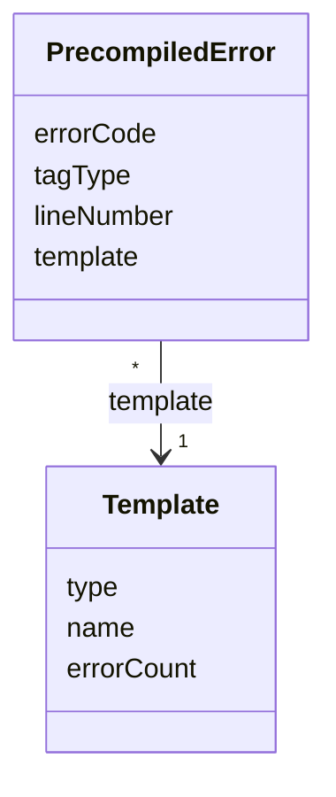

# TN0704 Precompiled Error

A **Precompiled Error** is one tag-syntax error found while a [Template](TN0401_template.md)'s
HTML is precompiled — tag markers that do not pair up, or a required attribute that is missing
or malformed. Errors are recorded per template together with the offending `tagType` and
`lineNumber`; the number of errors from the latest analysis is stored as `Template.errorCount`,
and a new [Deploy Task](TN0701_deploy_task.md) is refused while any template of the project has
`errorCount > 0`. These precompile error codes (`PagerErrorCode`) are **distinct from the REST
API error codes** documented in [/doc/backend_error/](../backend_error/README.md).

## Code mapping

| Class | DB table | Source |
|---|---|---|
| `PrecompiledError` | `pager_precompiled_error` | [PrecompiledError.kt](/source/pager-backend/domain/src/main/kotlin/com/xwkj/pager/domain/model/database/PrecompiledError.kt) |
| `PagerErrorCode` (enum) | — (stored as string via `@Enumerated(EnumType.STRING)`) | [PagerErrorCode.kt](/source/pager-backend/domain/src/main/kotlin/com/xwkj/pager/domain/model/enum/PagerErrorCode.kt) |

The Spring Data repository for this entity is named `PagerErrorDao` — not
`PrecompiledErrorDao` (recorded verbatim).

## Important fields

| Field | Type | Description |
|---|---|---|
| `id` | `Long?` | Primary key (auto-generated). |
| `createAt` | `Long` | Creation timestamp (epoch milliseconds). |
| `errorCode` | `PagerErrorCode` | What is wrong with the tag (see the value table below). |
| `tagType` | `TagType` | Which tag kind the error was found on (see the enum on [Pager Tag](TN0403_pager_tag.md)); stored as string via `@Enumerated(EnumType.STRING)`. |
| `lineNumber` | `Int` | The line of the template file the error was found on (`0` when no specific line applies). |
| `template` | `Template` | `@ManyToOne`, join column `template_id` — the [Template](TN0401_template.md) whose content contains the error. |

### `errorCode` — enum `PagerErrorCode`

In these value names, "label" denotes a pager-tag start / end **marker** in the HTML — not the
[Label](TN0303_label.md) content model.

| Value | Description |
|---|---|
| `LABEL_NOT_PAIRED` | An odd number of markers of the tag kind is found — a start marker has no matching end marker. |
| `TOO_MANY_LABELS` | More than one pair of a tag that may appear at most once per file (a unique tag such as `{pager:pagebar}` or `{pager:navlist}`). |
| `START_LABEL_ERROR` | The start marker is malformed — it does not match the exact start-tag pattern. |
| `END_LABEL_ERROR` | The end marker is malformed — it does not match the exact end-tag pattern (`{/pager:...}`). |
| `PAIRED_LABELS_IN_SINGLE_LINE` | The start and end markers of a pair sit on the same line, which is not allowed. |
| `ARTICLE_LIST_ID_REQUIRED` | A `{pager:list}` tag has no `id` attribute. |
| `ARTICLE_LIST_NOT_FOUND` | The `id` of a `{pager:list}` tag matches no [Article List](TN0502_article_list.md) identifier of the project. |
| `INT_VALUE_REQUIRED` | An integer attribute (e.g. `size`) carries a non-integer value. |
| `INCLUDE_FILE_REQUIRED` | A `{pager:include}` tag has no `file` attribute. |
| `INCLUDE_FILE_EMPTY` | The `file` attribute of a `{pager:include}` tag is empty. |
| `BOOLEAN_VALUE_REQUIRED` | A boolean attribute (e.g. `paging`) carries a non-boolean value. |
| `UNKNOWN` | Fallback value; used in the analysers as the placeholder code of the base error object before a concrete code is assigned. |

## Relationships

- **[Template](TN0401_template.md)** — referenced by `template` (join column `template_id`);
  many errors (`*`) belong to one (`1`) template. On each analysis the template's existing
  errors are deleted and re-created, and `Template.errorCount` is set to the size of the new
  error list — the error count surfaced in the CMS is this field, with the error details read
  back through `PagerErrorDao.findByTemplate`.
- **[Deploy Task](TN0701_deploy_task.md)** — not a foreign key: `DeployService.deploy` returns
  the error templates instead of creating a deploy task while any template of the project has
  `errorCount > 0`, and the consumer sets a running task to `INTERRUPTED_BY_ERRORS` under the
  same condition.
- **[Precompiled Tag](TN0703_precompiled_tag.md)** — produced by the same analysis; the
  `PrecompileTagAnalyseResult` wrappers pair each extracted tag with the errors found alongside
  it.
- **[Pager Tag](TN0403_pager_tag.md)** — `tagType` names the tag kind the error belongs to; tag
  syntax is defined in the [template tag reference](../../plan/common/template-tags.md).

## Diagram

