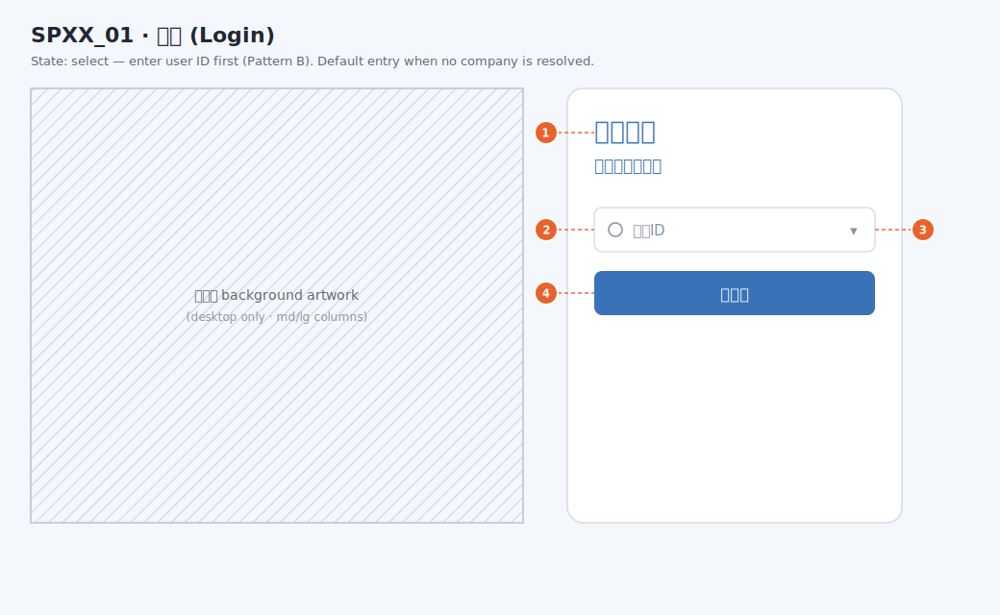
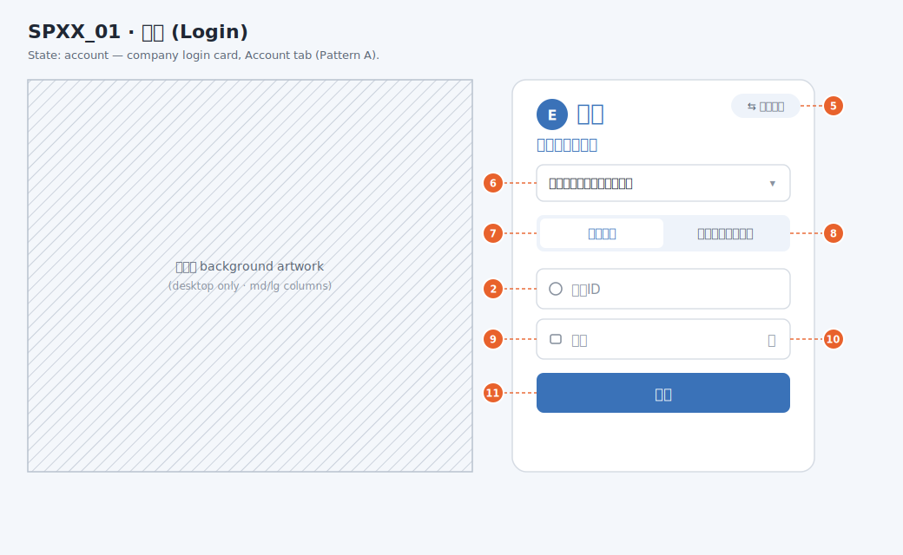
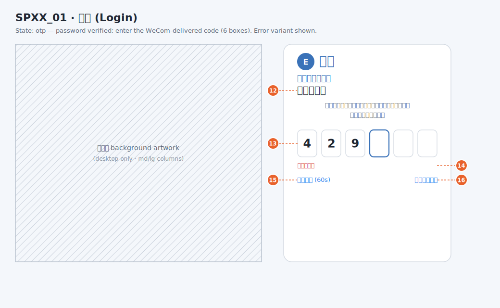
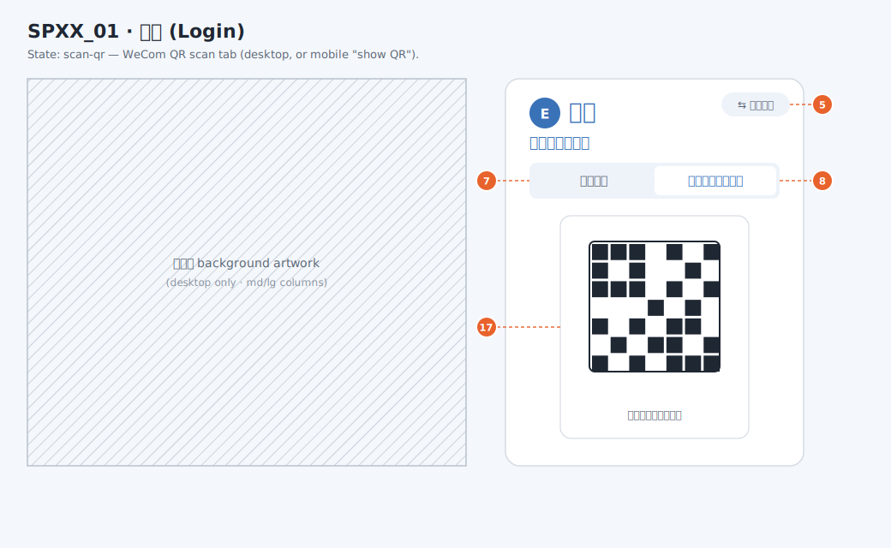
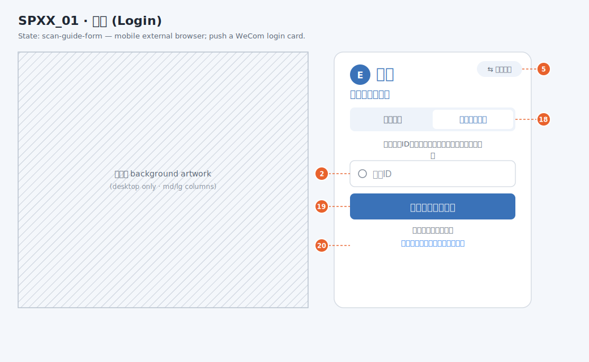
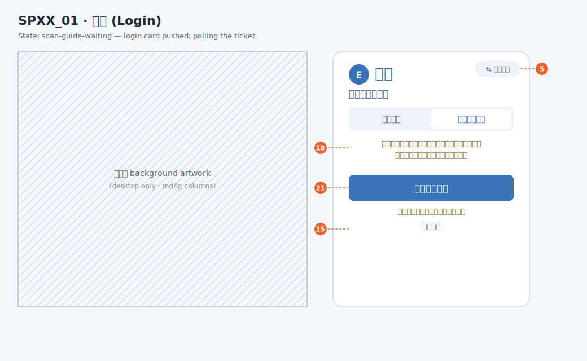
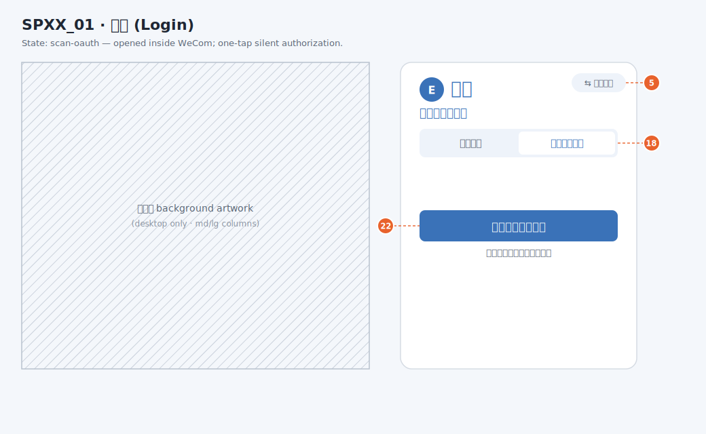
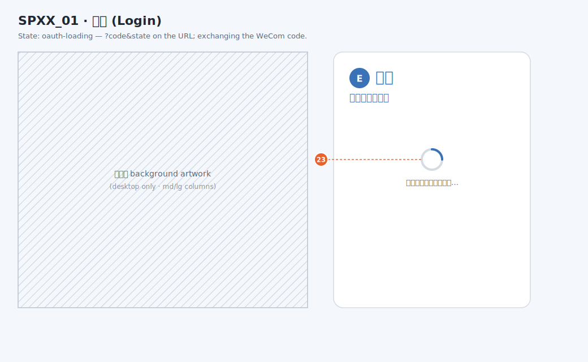

# Example Spec — Login (`SPXX_01`)

This is a **worked example** of a spec (PRD) doc that satisfies every item in the
[Template](../../template.md). It is a real, non-trivial screen — the login screen, which hosts
several login methods (account + password, WeCom scan, and a company-select entry) and an OTP
challenge — so it exercises multi-state wireframes, referenced APIs, validations, and error
tables. Copy this folder's structure when writing a new spec; read the [README](../../README.md)
for the common rules first.

> **Folder convention:** one spec = one folder. This spec lives at
> `example/login/README.md`; its wireframes live beside it in `svg/`, one `.drawio.svg` per status,
> embedded with ``. Each `.drawio.svg` is both the rendered image
> and the editable draw.io source (open it in draw.io / the VS Code extension). A wireframe file is
> named after the Statuses `Name` it renders (see [Design](../../design.md)).

## Screen Name

`登录` (Login)

## Ref

- Plan (backend): [login_otp_be.md](/plan/release/1.3.1/login-otp-be.md),
  [login_default_company_be.md](/plan/release/1.3.1/login-default-company-be.md)
- Plan (frontend): [login_otp_fe.md](/plan/release/1.3.1/login-otp-fe.md),
  [login_identifier_history_fe.md](/plan/release/1.3.1/login-identifier-history-fe.md)
- Wireframes: [`./svg/`](./svg/) — one `.drawio.svg` per state below

## Statuses

| No | Name | Description |
| --- | --- | --- |
| 1 | select | User-ID-first entry (Pattern B); shown when the URL carries no company. The user enters an account identifier and the resolved companies are listed |
| 2 | account | Company login card, Account tab (Pattern A); the entry when a company is already resolved from the URL |
| 3 | otp | Password verified and the chosen company has a bound OTP app; the user enters the 6-digit code delivered via WeCom. Includes the wrong-code error variant |
| 4 | scan-qr | WeCom QR-scan tab (desktop, or "show QR" on mobile) |
| 5 | scan-guide-form | Mobile external browser; the user enters the identifier to push a WeCom login card |
| 6 | scan-guide-waiting | The WeCom login card has been pushed; the screen polls the login ticket |
| 7 | scan-oauth | Opened inside the WeCom app; one-tap silent authorization |
| 8 | oauth-loading | Returned from WeCom with `?code&state` on the URL; the code is being exchanged |

## Component Parameters

N/A (this screen is a page, not a parameterized component).

## Design

See [Design](../../design.md) for how to draw and annotate a wireframe. One `.drawio.svg` per
status listed in [Statuses](#statuses); the file name matches the status `Name`. Every status is
embedded and annotated below so the whole screen can be reviewed from this doc without opening the
image files.

**Component numbering:** components are numbered **continuously across the whole doc** (No.1, No.2,
…), and each number is the badge shown on the wireframe. A component that appears in more than one
status keeps its **one** number everywhere and is **described only at its first appearance**; a
later status that reuses it lists the number and points back rather than re-describing it.

> **Editing:** a real wireframe is a `.drawio.svg` — draw.io's editable-SVG format, where the file
> the doc renders is the same file you edit in draw.io / the VS Code extension (see
> [Design](../../design.md)).
>
> **Note on this example:** the SVGs in [`svg/`](./svg/) are **placeholder hand-drawn art** — they
> render and carry the numbering, but their embedded draw.io model is empty, so opening one in
> draw.io shows a blank canvas. To make them truly editable, redraw each status in draw.io and save
> over the file. The rest of this doc (structure, numbering, tables, references) is the part to
> imitate.

### 1. select — [`./svg/select.drawio.svg`](./svg/select.drawio.svg)

| No | Name | IOE | Description | No Permission Display |
| --- | --- | --- | --- | --- |
| 1 | Welcome heading (`欢迎登录`) | - | Static greeting shown above the form | - |
| 2 | Identifier input (`用户ID`) | I | The account identifier. See [Validation](#validation). In this status it drives company resolution in [Resolve companies](#resolve-companies) | - |
| 3 | Company dropdown (`▾`) | I/O | Lists the companies resolved for the identifier; the default company is preselected. See [Resolve companies](#resolve-companies) | - |
| 4 | Next button (`下一步`) | E | Navigates to the `account` status for the chosen company. Disabled until a company is chosen | - |

### 2. account — [`./svg/account.drawio.svg`](./svg/account.drawio.svg)

| No | Name | IOE | Description | No Permission Display |
| --- | --- | --- | --- | --- |
| 5 | Switch account (`⇆ 切换账号`) | E | Returns to the `select` status | - |
| 6 | Company selector (`荏原（中国）投资有限公司`) | I/O | The chosen company; opens a dropdown to switch companies without leaving the card | - |
| 7 | Account tab (`账号登录`) | E | Selects password login (the active tab in this status) | - |
| 8 | WeCom scan tab (`企业微信扫码登录`) | E | Switches to [WeCom scan login](#wecom-scan-login) (`scan-qr`) | - |
| [2](#component-2) | Identifier input (`用户ID`) | I | Same as [No.2](#component-2) | - |
| 9 | Password input (`密码`) | I | The user's password, masked; the 👁 toggle reveals it. See [Validation](#validation) | - |
| 10 | Password reveal (`👁`) | E | Toggles password visibility | - |
| 11 | Login button (`登录`) | E | Submits the form. Disabled while submitting. See [Account login](#account-login) | - |

### 3. otp — [`./svg/otp.drawio.svg`](./svg/otp.drawio.svg)

| No | Name | IOE | Description | No Permission Display |
| --- | --- | --- | --- | --- |
| 12 | Code label (`输入验证码`) | - | Prompt above the code boxes | - |
| 13 | OTP code boxes | I | 6 single-digit boxes. See [Validation](#validation). Verified in [Verify OTP](#verify-otp) | - |
| 14 | Error message (`验证码错误`) | O | Displays the message for the returned error code; the wireframe renders the wrong-code variant | - |
| 15 | Resend button (`重新发送 (60s)`) | E | Re-sends the code; disabled during the cooldown, showing the remaining seconds. See [Verify OTP](#verify-otp) | - |
| 16 | Back to account login (`返回账号登录`) | E | Returns to the `account` status | - |

### 4. scan-qr — [`./svg/scan-qr.drawio.svg`](./svg/scan-qr.drawio.svg)

| No | Name | IOE | Description | No Permission Display |
| --- | --- | --- | --- | --- |
| [5](#component-5) | Switch account (`⇆ 切换账号`) | E | Same as [No.5](#component-5) | - |
| [7](#component-7) | Account tab (`账号登录`) | E | Same as [No.7](#component-7) | - |
| [8](#component-8) | WeCom scan tab (`企业微信扫码登录`) | E | Same as [No.8](#component-8) | - |
| 17 | QR code (`企业微信扫一扫登录`) | O | The WeCom login QR the user scans. See [WeCom scan login](#wecom-scan-login) | - |

### 5. scan-guide-form — [`./svg/scan-guide-form.drawio.svg`](./svg/scan-guide-form.drawio.svg)

| No | Name | IOE | Description | No Permission Display |
| --- | --- | --- | --- | --- |
| [5](#component-5) | Switch account (`⇆ 切换账号`) | E | Same as [No.5](#component-5) | - |
| 18 | WeCom login title (`企业微信登录`) | - | Section heading for the WeCom flow | - |
| [2](#component-2) | Identifier input (`用户ID`) | I | Same as [No.2](#component-2) | - |
| 19 | Send WeCom login (`发送企业微信登录`) | E | Pushes the login card and moves to `scan-guide-waiting`. See [WeCom scan login](#wecom-scan-login) | - |
| 20 | Show QR (`显示二维码（用其他设备扫码）`) | E | Switches to the `scan-qr` status to scan from another device | - |

### 6. scan-guide-waiting — [`./svg/scan-guide-waiting.drawio.svg`](./svg/scan-guide-waiting.drawio.svg)

| No | Name | IOE | Description | No Permission Display |
| --- | --- | --- | --- | --- |
| [5](#component-5) | Switch account (`⇆ 切换账号`) | E | Same as [No.5](#component-5) | - |
| [18](#component-18) | WeCom login title (`企业微信登录`) | - | Same as [No.18](#component-18) | - |
| 21 | Open WeCom (`打开企业微信`) | E | Deep-links into the WeCom app to approve the pushed card | - |
| [15](#component-15) | Resend (`重新发送`) | E | Same as [No.15](#component-15) | - |

### 7. scan-oauth — [`./svg/scan-oauth.drawio.svg`](./svg/scan-oauth.drawio.svg)

| No | Name | IOE | Description | No Permission Display |
| --- | --- | --- | --- | --- |
| [5](#component-5) | Switch account (`⇆ 切换账号`) | E | Same as [No.5](#component-5) | - |
| [18](#component-18) | WeCom login title (`企业微信登录`) | - | Same as [No.18](#component-18) | - |
| 22 | One-tap login (`企业微信一键登录`) | E | Silent authorization when opened inside the WeCom app. See [WeCom scan login](#wecom-scan-login) | - |

### 8. oauth-loading — [`./svg/oauth-loading.drawio.svg`](./svg/oauth-loading.drawio.svg)

| No | Name | IOE | Description | No Permission Display |
| --- | --- | --- | --- | --- |
| 23 | Loading indicator | O | Shown while the WeCom OAuth `code` is exchanged for a session. See [WeCom scan login](#wecom-scan-login) | - |

## Validation

See [Validation](../../validation.md) for the format.

**Identifier input** ([No.2](#component-2))

- not empty
  - error message: `请输入账号`
  - trigger: blur, submit

**Password input** ([No.9](#component-9))

- not empty
  - error message: `请输入密码`
  - trigger: blur, submit

**OTP code input** (otp state)

- exactly 6 digits
  - error message: `请输入6位验证码`
  - trigger: submit

## Permission

| Permission | Required | Description |
| --- | --- | --- |
| N/A (public) | ❌ | The login screen and all of its APIs are reachable without authentication |

## Endpoint

- `/login` — `select` / `account` states (company resolved from a query param when present)
- `/login/otp` — `otp` state
- `/login/wecom/callback` — `oauth-loading` state (WeCom OAuth redirect target)

## Apis

Each API is documented in its own doc under [`/plan/api/Account/`](/doc/api/account/README.md);
this spec **references** them rather than restating request/response shapes.

- api 1: `GET /public/v1/account/{accountIdentifier}/company` —
  [list-account-login-companies](/doc/api/account/list_account_login_companies.md)
- api 2: `POST /public/v1/account/login` — [login-account](/doc/api/account/login_account.md)
- api 3: `POST /public/v1/account/login/otp` — [verify-login-otp](/doc/api/account/verify_login_otp.md)
- api 4: `POST /public/v1/account/login/otp/resend` — [resend-login-otp](/doc/api/account/resend_login_otp.md)
- api 5: `POST /public/v1/account/login/wecom/ticket` — [start-wecom-login-ticket](/doc/api/account/start_wecom_login_ticket.md)
- api 6: `GET /public/v1/account/login/wecom/ticket/{ticket}` — [poll-wecom-login-ticket](/doc/api/account/poll_wecom_login_ticket.md)
- api 7: `POST /public/v1/account/login/wecom` — [login-via-wecom](/doc/api/account/login_via_wecom.md)

## Functions

### Resolve companies

Answers the [3 questions](../../functions.md#the-3-questions-a-function-must-answer) for the
`select` state ([No.2](#component-2), [No.3](#component-3)).

**UI/UX**

- Trigger: the identifier input ([No.2](#component-2)) blurs with a non-empty value.
- Prevent repeated operations: debounce the lookup; ignore a lookup while one is in flight.
- UI feedback:
  - **In progress:** the company select ([No.3](#component-3)) shows a loading state.
  - **Success:** populate the select with the returned companies and preselect the one flagged
    `default`; enable Next ([No.4](#component-4)).
  - **Failure:** show the error under the identifier input.

**Business logic**

- Request sending: `GET /public/v1/account/{accountIdentifier}/company` — see
  [list-account-login-companies](/doc/api/account/list_account_login_companies.md).
- Response (success only): the [Company](/doc/tech_noun/README.md) list this account can log into,
  with a `default` flag; the FE preselects the default and carries the chosen `identifier` into the
  `account` state.

**Error handling**

| Case | Error Code | Action |
| --- | --- | --- |
| Unknown identifier, or no valid user in any company | [45001 AccountNotFound](/doc/backend_error/account/45001.md) | Show `账号不存在` under the identifier input; keep the field editable |

### Account login

Answers the [3 questions](../../functions.md#the-3-questions-a-function-must-answer) for the Login
action ([No.11](#component-11)).

**UI/UX**

- Trigger: click Login ([No.11](#component-11)) or press Enter in a field.
- Prevent repeated operations: disable the button and show a spinner while the request is in flight.
- Data validation: run the front-end checks in [Validation](#validation) before sending; if any
  fail, show the inline messages and do not send the request.
- UI feedback:
  - **In progress:** the Login button is disabled with a spinner.
  - **Success (direct login):** store the returned session and redirect to the home screen.
  - **Success (OTP required):** transition to the `otp` state carrying the returned `otpToken`.
  - **Failure:** show the message for the returned error code in the login form.

**Business logic**

- Request sending: `POST /public/v1/account/login` with the identifier, password, and chosen
  company identifier — see [login-account](/doc/api/account/login_account.md) for the full shape.
- Backend-only validation: verify the account exists, the password matches, and the account has a
  valid user in the chosen company (cannot be enforced on the front end).
- Response (success only): either a direct login result **or** a pending OTP challenge — exactly
  one is returned. A direct login carries the session token and the signed-in
  [Account](/doc/tech_noun/TN0104_account.md) (first-mention link; later mentions are plain text);
  when the company has a bound OTP app, an OTP challenge (`otpToken`) is returned instead and the
  user continues via [Verify OTP](#verify-otp).

**Error handling**

| Case | Error Code | Action |
| --- | --- | --- |
| Unknown identifier, or the account has no valid user | [45001 AccountNotFound](/doc/backend_error/account/45001.md) | Show `账号或密码错误` in the login form; keep the form editable |
| Password does not match | [45002 AccountPasswordWrong](/doc/backend_error/account/45002.md) | Show `账号或密码错误` in the login form; keep the form editable |
| Account has no valid user in the chosen company | [45008 AccountNotInCompany](/doc/backend_error/login_otp/45008.md) | Show `该账号在所选公司下无可用用户`; keep the form editable |

### Verify OTP

Answers the [3 questions](../../functions.md#the-3-questions-a-function-must-answer) for the `otp`
state.

**UI/UX**

- Trigger: the 6th digit is entered, or the user presses Enter.
- Prevent repeated operations: disable the input while verifying.
- UI feedback:
  - **In progress:** show a verifying state on the code input.
  - **Success:** store the returned session and redirect to the home screen.
  - **Failure:** show the message for the returned error code; on a wrong code, keep the input
    editable (the `otp` wireframe shows this variant — `验证码错误`).
- Resend: the `重新发送` button is disabled during the cooldown window and shows the remaining
  seconds; clicking it calls [resend-login-otp](/doc/api/account/resend_login_otp.md).

**Business logic**

- Request sending: `POST /public/v1/account/login/otp` with the `otpToken` and `code` — see
  [verify-login-otp](/doc/api/account/verify_login_otp.md).
- Response (success only): the session token and the signed-in Account, same shape as a direct
  login.

**Error handling**

| Case | Error Code | Action |
| --- | --- | --- |
| Challenge not found or expired | [45004 LoginOtpNotFound](/doc/backend_error/login_otp/45004.md) | Show `验证码已失效，请返回重新登录`; return to the `account` state |
| Wrong OTP code | [45005 LoginOtpCodeWrong](/doc/backend_error/login_otp/45005.md) | Show `验证码错误`; keep the input editable |
| Too many wrong attempts | [45006 LoginOtpTooManyAttempts](/doc/backend_error/login_otp/45006.md) | Show `尝试次数过多，请返回重新登录`; return to the `account` state |
| Resend inside the cooldown window | [45007 LoginOtpResendTooFrequent](/doc/backend_error/login_otp/45007.md) | Keep the resend button disabled; the countdown already reflects the wait |

### WeCom scan login

Answers the [3 questions](../../functions.md#the-3-questions-a-function-must-answer) for the WeCom
tab and its states (`scan-qr`, `scan-guide-form`, `scan-guide-waiting`, `scan-oauth`,
`oauth-loading`).

**UI/UX**

- Desktop / "show QR": render a QR code (`scan-qr`) the user scans with the WeCom app.
- Mobile external browser: enter the identifier (`scan-guide-form`) to push a login card, then
  poll while waiting (`scan-guide-waiting`).
- Inside the WeCom app: offer one-tap silent authorization (`scan-oauth`).
- On return from WeCom OAuth (`oauth-loading`): exchange the `?code&state`; on success redirect to
  the home screen.

**Business logic**

- Ticket flow (`scan-guide-*`): `POST /public/v1/account/login/wecom/ticket`
  ([start-wecom-login-ticket](/doc/api/account/start_wecom_login_ticket.md)) returns a `ticket`;
  the browser polls `GET /public/v1/account/login/wecom/ticket/{ticket}`
  ([poll-wecom-login-ticket](/doc/api/account/poll_wecom_login_ticket.md)) until `status` is
  `SUCCESS` (login payload attached) or `EXPIRED`.
- OAuth flow (`oauth-loading`): `POST /public/v1/account/login/wecom`
  ([login-via-wecom](/doc/api/account/login_via_wecom.md)) exchanges the OAuth code for a session.

**Error handling**

| Case | Error Code | Action |
| --- | --- | --- |
| WeCom app not found or disabled | [43004 WecomAppNotFound](/doc/backend_error/webhook_wecom/43004.md) | Show `企业微信登录暂不可用`; fall back to the Account tab |
| OAuth code exchange failed | [43009 WecomOauthFailed](/doc/backend_error/webhook_wecom/43009.md) | Show `企业微信授权失败，请重试`; return to the Account tab |
| No OA user matches the WeCom member | [43010 WecomUserNotBound](/doc/backend_error/webhook_wecom/43010.md) | Show `该企业微信账号未绑定用户`; return to the Account tab |

## Topics

N/A.
